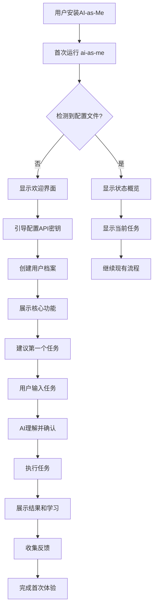
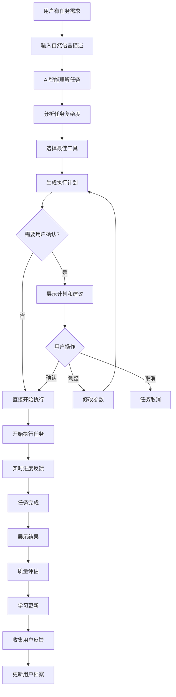
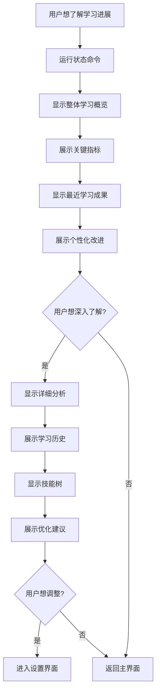
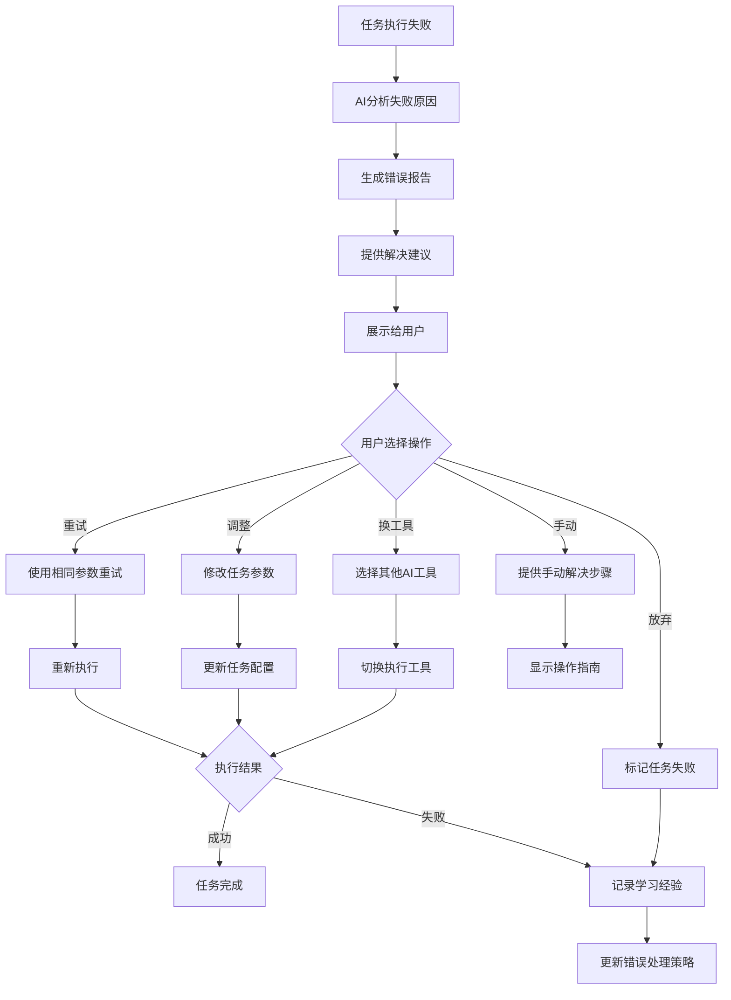
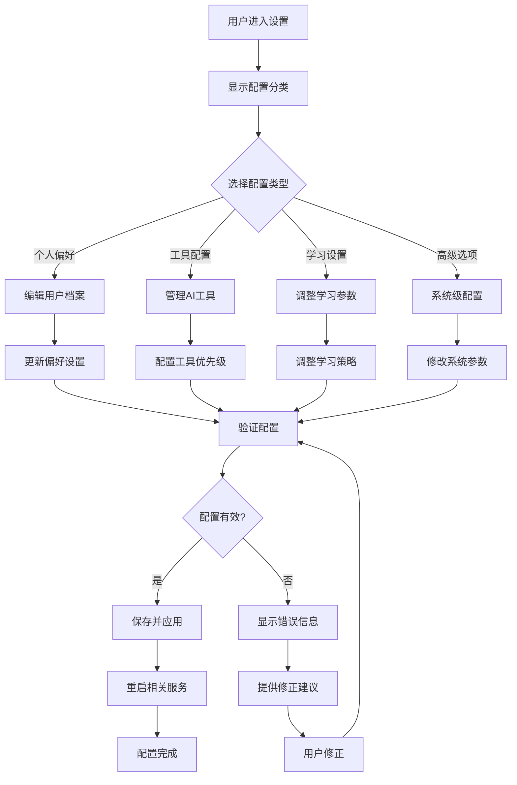

# UX Design Specification - AI-as-Me v2.0

_This document builds collaboratively through step-by-step UX discovery. Sections are appended as we work through each design decision together._

## Project Context Analysis

### Product Overview

**AI-as-Me v2.0** 是一个 Agent CLI 编排系统，核心理念是"不造轮子，只做编排"。系统通过 Soul 注入机制实现个性化，通过养蛊循环实现自进化学习。

### UX Design Scope

**MVP 阶段 (P0)**:
- **CLI 优先**: 主要交互通过命令行界面
- **文件系统**: Soul 数据通过 Markdown 文件管理
- **简单反馈**: 基础的命令行输出和状态显示

**v2.1 阶段 (P1)**:
- **Web 仪表板**: 任务看板视图和系统监控
- **可视化界面**: Soul 学习进度和系统健康状态
- **交互增强**: 实时更新和用户反馈机制

### Target User Profile

**主要用户**: Jody - 技术型独立 AI 创业者
- **技术背景**: 深度技术背景，熟悉命令行操作
- **使用场景**: 日常开发工作中的 AI 协作
- **期望**: 高效、直观、可定制的工具体验
- **痛点**: 传统 AI 工具缺乏持续学习和个性化

### Design Constraints

**技术约束**:
- Python + FastAPI 技术栈
- 本地优先的数据存储
- 跨平台兼容性 (Linux/macOS/Windows)

**时间约束**:
- MVP 4天实施限制
- CLI 优先，Web UI 为后续版本

**用户约束**:
- 单用户场景 (MVP 阶段)
- 技术用户，接受命令行操作
- 个性化和学习效果是核心价值
## Project Understanding & UX Context

### Core Product Differentiation

**AI-as-Me v2.0** 的 UX 设计必须体现其核心差异化价值：

**从"工具"到"伙伴"的转变**:
- 传统 AI 工具: 用完即弃，每次重新解释
- AI-as-Me: 持续学习，越用越懂你

**"养蛊"自进化的可视化**:
- 学习进度的可感知性
- 个性化效果的直观展示
- 进化轨迹的可追踪性

### User Experience Goals

#### 主要 UX 目标

1. **效率优先** (Efficiency First)
   - 减少重复操作和解释
   - 快速任务创建和状态查看
   - 智能化的默认选项和建议

2. **学习可感知** (Learning Visibility)
   - 用户能够感知到 AI 分身在学习
   - 个性化改进的可视化反馈
   - 学习效果的量化展示

3. **控制感** (Sense of Control)
   - 用户能够理解和调整 AI 行为
   - 透明的决策过程
   - 可定制的个性化设置

4. **信任建立** (Trust Building)
   - 一致的行为表现
   - 可预测的结果质量
   - 错误的优雅处理和学习

#### 次要 UX 目标

5. **渐进披露** (Progressive Disclosure)
   - MVP 阶段简单直接
   - 高级功能逐步引入
   - 复杂性按需展现

6. **个性化体验** (Personalized Experience)
   - 适应用户的工作习惯
   - 个性化的界面和交互
   - 基于使用历史的优化

### UX Design Principles

#### 1. CLI-First, Web-Enhanced
- **MVP**: CLI 为主要交互方式，简洁高效
- **v2.1**: Web 界面作为 CLI 的可视化增强，不替代

#### 2. Learning-Centric Design
- 所有界面元素都要体现"学习"和"进化"
- 用户行为和反馈是设计的核心输入
- 学习效果的可视化是关键设计要素

#### 3. Transparency & Control
- 用户始终了解 AI 分身在做什么
- 提供足够的控制选项但不过度复杂
- 决策过程的可解释性

#### 4. Contextual Intelligence
- 界面根据使用上下文智能调整
- 基于历史行为的预测性设计
- 情境感知的信息展示

#### 5. Graceful Evolution
- 从简单到复杂的平滑过渡
- 功能的渐进式引入
- 向后兼容的设计决策

### User Mental Models

#### 当前心智模型 (传统 AI 工具)
```
用户 → 输入需求 → AI 处理 → 获得结果 → 结束
```
- 每次交互都是独立的
- 需要重复解释上下文
- 结果质量不可预测

#### 目标心智模型 (AI-as-Me)
```
用户 ↔ AI 分身 (持续学习) ↔ 任务执行 ↔ 结果优化
         ↓
    个性化知识库
```
- AI 分身是持续的合作伙伴
- 每次交互都在积累知识
- 结果质量随时间提升

### Key UX Challenges

#### 1. 学习效果的可感知性
**挑战**: 如何让用户感知到 AI 分身在学习和改进？
**设计方向**: 
- 学习进度指示器
- 个性化改进的对比展示
- 学习里程碑的庆祝

#### 2. CLI 到 Web 的一致性
**挑战**: 如何保持 CLI 和 Web 界面的体验一致性？
**设计方向**:
- 统一的信息架构
- 一致的术语和概念
- 互补而非重复的功能

#### 3. 复杂性的渐进管理
**挑战**: 如何在简单易用和功能丰富之间平衡？
**设计方向**:
- 分层的信息展示
- 渐进式功能披露
- 智能默认设置

#### 4. 信任和透明度
**挑战**: 如何建立用户对 AI 分身的信任？
**设计方向**:
- 决策过程的可视化
- 错误处理的透明化
- 用户控制选项的提供

### Success Metrics for UX

#### 定量指标
- **任务完成效率**: 相比传统工具的时间节省
- **学习效果感知**: 用户对个性化改进的满意度评分
- **功能发现率**: 用户对高级功能的使用率
- **错误恢复率**: 用户从错误中恢复的成功率

#### 定性指标
- **情感连接**: 用户是否将 AI 分身视为"伙伴"
- **信任程度**: 用户对 AI 决策的信任水平
- **学习动机**: 用户是否愿意投入时间"训练"AI 分身
- **长期价值感知**: 用户对持续使用价值的认知
## Core Experience Definition

### Primary Experience Platform

**CLI-First Architecture** (MVP - P0)

**核心交互模式**:
```bash
# 核心工作流
ai-as-me task add "创建用户认证API"
ai-as-me task list --status todo
ai-as-me agent start
ai-as-me serve  # 启动 Web 仪表板 (v2.1)
```

**CLI 体验设计原则**:
- **简洁性**: 最少的必需参数，智能默认值
- **一致性**: 统一的命令结构和参数模式
- **反馈性**: 清晰的状态反馈和进度指示
- **可发现性**: 内置帮助和命令提示

### Core User Experience Flow

#### 体验流程1: 初次设置体验 (Onboarding)

**目标**: 让用户快速理解 AI-as-Me 的独特价值

```
1. 安装和初始化
   ai-as-me setup
   ↓
2. Soul 配置引导
   "让我了解你的工作风格..."
   ↓
3. 首个任务体验
   "让我们试试第一个任务"
   ↓
4. 学习效果展示
   "看，我已经开始学习你的偏好了"
```

**关键体验要素**:
- **渐进式引导**: 不一次性展示所有功能
- **价值快速体现**: 在前3分钟内展示个性化效果
- **学习可视化**: 实时显示 AI 分身的学习过程
- **成功庆祝**: 首次成功任务的积极反馈

#### 体验流程2: 日常使用体验 (Daily Workflow)

**目标**: 高效、流畅的日常任务处理

```
1. 快速任务创建
   ai-as-me task add "优化数据库查询性能"
   ↓
2. 智能任务处理
   [AI 分身自动选择最适合的工具]
   ↓
3. 实时进度反馈
   "正在使用 Claude Code 处理..."
   ↓
4. 结果展示和学习
   "任务完成！我学到了你偏好的代码风格"
```

**关键体验要素**:
- **零摩擦启动**: 一条命令开始任务
- **智能化处理**: 自动选择工具和参数
- **透明进度**: 清晰的执行状态和预期时间
- **学习反馈**: 每次任务后的学习总结

#### 体验流程3: 长期进化体验 (Evolution Journey)

**目标**: 让用户感受到 AI 分身的持续进化

```
1. 使用历史回顾
   ai-as-me stats --learning
   ↓
2. 个性化改进展示
   "相比一个月前，我的准确率提升了25%"
   ↓
3. 新能力发现
   "我学会了你的新工作模式"
   ↓
4. 进化里程碑
   "恭喜！我们达到了新的协作水平"
```

**关键体验要素**:
- **进化可视化**: 学习曲线和改进轨迹
- **里程碑庆祝**: 重要进步的积极反馈
- **能力发现**: 新学会技能的主动展示
- **长期价值**: 持续使用的价值体现

### Platform Experience Strategy

#### MVP 阶段 (CLI-Only)

**核心体验**:
- **命令行界面**: 简洁、高效、专业
- **文本反馈**: 结构化的状态和结果显示
- **文件系统**: Soul 数据的直观文件管理

**体验优化**:
```bash
# 智能提示和自动补全
ai-as-me task add [TAB] → 显示常用任务模板
ai-as-me task list --[TAB] → 显示可用过滤选项

# 丰富的状态反馈
✓ 任务已创建 (ID: task-001)
⚡ 正在使用 Claude Code 处理...
📊 预计完成时间: 2分钟
🎯 任务完成！准确率: 92%
```

#### v2.1 阶段 (CLI + Web Dashboard)

**Web 界面作为 CLI 的可视化增强**:

**看板视图**:
```
┌─────────────┬─────────────┬─────────────┬─────────────┐
│   Inbox     │    Todo     │   Doing     │    Done     │
├─────────────┼─────────────┼─────────────┼─────────────┤
│ 新任务      │ 待处理任务   │ 执行中任务   │ 已完成任务   │
│ 快速添加    │ 优先级排序   │ 实时进度    │ 结果查看    │
└─────────────┴─────────────┴─────────────┴─────────────┘
```

**学习仪表板**:
```
┌─────────────────────────────────────────────────────────┐
│                   AI 分身学习概览                        │
├─────────────────────────────────────────────────────────┤
│ 📈 学习曲线    📊 技能分布    🎯 准确率趋势              │
│ 🧠 知识图谱    ⚡ 效率提升    🏆 里程碑成就              │
└─────────────────────────────────────────────────────────┘
```

### Effortless Interaction Design

#### 智能默认值策略

**任务创建**:
- 自动检测任务类型 (代码/文档/分析)
- 基于历史偏好选择默认工具
- 智能填充常用参数

**上下文感知**:
- 基于当前目录推断项目上下文
- 根据时间和历史模式调整行为
- 自动加载相关的 Soul 规则

#### 渐进式复杂度

**新手模式**:
```bash
ai-as-me task add "简单描述"  # 自动处理所有细节
```

**专家模式**:
```bash
ai-as-me task add "详细描述" \
  --agent claude \
  --template custom \
  --priority high \
  --context project-alpha
```

#### 错误预防和恢复

**预防策略**:
- 命令验证和智能提示
- 危险操作的确认机制
- 自动备份重要数据

**恢复策略**:
- 清晰的错误信息和建议
- 一键撤销和重试机制
- 学习错误模式避免重复

### Experience Continuity

#### CLI 到 Web 的无缝切换

**数据同步**:
- 实时状态同步
- 一致的任务标识
- 统一的历史记录

**交互一致性**:
- 相同的术语和概念
- 一致的操作逻辑
- 互补的功能设计

#### 跨会话的体验连续性

**状态保持**:
- 任务进度的持久化
- 学习状态的保存
- 用户偏好的记忆

**上下文恢复**:
- 智能的会话恢复
- 工作状态的自动恢复
- 个性化设置的保持
## Desired Emotional Response & Brand Experience

### Primary Emotional Goals

#### 1. 伙伴关系感 (Partnership)
**目标情感**: "这不是工具，这是我的 AI 伙伴"

**设计表现**:
- **个性化称呼**: AI 分身有独特的"个性"表现
- **协作语言**: 使用"我们一起"而非"系统为您"
- **学习庆祝**: 共同成长的里程碑庆祝
- **记忆体现**: "还记得上次我们处理类似任务时..."

**避免的情感**: 冷冰冰的工具感、一次性交易感

#### 2. 成长满足感 (Growth Satisfaction)
**目标情感**: "我能感受到我们都在变得更好"

**设计表现**:
- **进步可视化**: 清晰的学习曲线和改进轨迹
- **能力解锁**: 新技能获得的积极反馈
- **效率提升**: 量化的时间节省和质量改进
- **智能惊喜**: 意外的智能行为和贴心建议

**避免的情感**: 停滞感、重复感、无意义感

#### 3. 控制自信感 (Confident Control)
**目标情感**: "我知道发生了什么，我能控制结果"

**设计表现**:
- **透明过程**: 清晰的决策逻辑和执行步骤
- **可调节性**: 丰富但不复杂的控制选项
- **可预测性**: 一致的行为模式和结果质量
- **错误友好**: 优雅的错误处理和学习机制

**避免的情感**: 黑盒恐惧、失控感、不可预测性

#### 4. 专业效率感 (Professional Efficiency)
**目标情感**: "这让我的工作更专业、更高效"

**设计表现**:
- **快速响应**: 流畅的交互和及时的反馈
- **智能默认**: 减少重复配置和选择
- **专业输出**: 高质量、可直接使用的结果
- **工作流集成**: 无缝融入现有工作习惯

**避免的情感**: 拖累感、复杂感、业余感

### Secondary Emotional Goals

#### 5. 探索乐趣感 (Discovery Joy)
**目标情感**: "发现新功能和改进是有趣的"

**设计表现**:
- **渐进披露**: 适时的新功能介绍
- **智能建议**: 基于使用模式的功能推荐
- **个性化发现**: 针对个人的定制化建议
- **成就解锁**: 游戏化的里程碑和成就

#### 6. 安全信任感 (Secure Trust)
**目标情感**: "我的数据和隐私是安全的"

**设计表现**:
- **本地优先**: 明确的本地存储说明
- **透明政策**: 清晰的数据使用说明
- **用户控制**: 数据导出和删除选项
- **安全反馈**: 安全操作的确认和提示

### Emotional Journey Mapping

#### 初次使用情感曲线
```
兴奋 → 好奇 → 惊喜 → 满意 → 期待
  ↓      ↓      ↓      ↓      ↓
安装   设置   首次   结果   未来
体验   Soul   任务   质量   使用
```

**关键情感转折点**:
- **首次 Soul 注入**: 从好奇到惊喜
- **首个任务完成**: 从期待到满意
- **学习效果体现**: 从满意到兴奋

#### 长期使用情感演进
```
Week 1: 新鲜感 + 学习期待
Week 2-4: 习惯形成 + 效率提升
Month 2-3: 深度依赖 + 伙伴感
Month 6+: 不可替代 + 共同成长
```

### Brand Personality & Tone

#### AI 分身的人格特征

**核心性格**:
- **智能而谦逊**: 聪明但不炫耀，学习而不自大
- **可靠而灵活**: 一致的表现，适应性的行为
- **专业而友好**: 工作导向，但有温度
- **成长导向**: 持续改进，永不满足现状

**沟通风格**:
```bash
# 专业但友好
✓ 任务完成！我注意到你偏好简洁的代码注释

# 学习导向
📚 我学到了新的模式，下次会做得更好

# 协作伙伴
🤝 让我们一起处理这个复杂任务

# 透明诚实
⚠️ 这个任务有些挑战，我可能需要几次尝试
```

#### 视觉情感语言

**CLI 界面情感设计**:
- **颜色语义**: 绿色(成功)、蓝色(进行中)、黄色(学习)、红色(错误)
- **图标情感**: ✓(完成)、⚡(处理)、📚(学习)、🎯(目标)
- **进度表现**: 动态的进度条和状态指示
- **反馈层次**: 不同重要性的信息层次

**Web 界面情感设计**:
- **温暖色调**: 避免冷冰冰的技术感
- **有机形状**: 圆角和流畅的线条
- **动态反馈**: 微动画和过渡效果
- **个性化元素**: 基于用户偏好的界面调整

### Emotional Design Patterns

#### 成功庆祝模式
```bash
🎉 里程碑达成！
你的 AI 分身已经完成了第 100 个任务
准确率提升至 95%，效率提升 40%

[查看学习报告] [分享成就] [设置新目标]
```

#### 学习反馈模式
```bash
📈 学习更新
我注意到你在 API 设计上有独特的偏好：
• 偏好 RESTful 风格
• 重视错误处理完整性
• 喜欢详细的文档注释

这些偏好已更新到我的知识库中
```

#### 错误恢复模式
```bash
😅 出了点小问题
Claude Code 暂时不可用，我已自动切换到 OpenCode
预计延迟 30 秒，我会从这次经历中学习

[查看详情] [手动重试] [调整设置]
```

#### 智能建议模式
```bash
💡 智能建议
基于你的使用模式，我建议：
• 为常用任务创建快捷模板
• 启用自动优先级排序
• 尝试新的 Gemini CLI 集成

[应用建议] [稍后提醒] [不再显示]
```

### Emotional Validation Metrics

#### 情感指标测量
- **伙伴关系感**: "我把 AI-as-Me 当作工作伙伴" (1-5分)
- **成长满足感**: "我能感受到系统在学习和改进" (1-5分)
- **控制自信感**: "我理解并能控制系统行为" (1-5分)
- **专业效率感**: "这提升了我的工作专业度" (1-5分)

#### 情感反馈收集
- **微表情反馈**: 任务完成后的快速情感评价
- **里程碑调研**: 重要节点的深度情感访谈
- **行为分析**: 通过使用模式推断情感状态
- **主动询问**: 适时的情感状态询问
## UX Pattern Analysis & Design Inspiration

### CLI-First Tools Inspiration

#### 1. Git - 版本控制的 UX 典范

**学习要点**:
- **一致的命令结构**: `git <verb> <noun>` 模式
- **智能状态反馈**: `git status` 的清晰信息层次
- **渐进式复杂度**: 从简单到高级命令的自然过渡
- **上下文感知**: 基于仓库状态的智能提示

**应用到 AI-as-Me**:
```bash
# 借鉴 Git 的命令结构
ai-as-me task add     # 类似 git add
ai-as-me task status  # 类似 git status
ai-as-me agent start  # 类似 git commit
```

#### 2. Docker - 复杂系统的简化交互

**学习要点**:
- **抽象复杂性**: 复杂的容器管理通过简单命令
- **状态可视化**: `docker ps` 的表格化状态展示
- **错误友好**: 清晰的错误信息和建议
- **生态集成**: 与其他工具的无缝集成

**应用到 AI-as-Me**:
```bash
# 状态展示的表格化设计
ai-as-me task list
ID    STATUS   AGENT      PROGRESS  CREATED
001   doing    claude     75%       2m ago
002   todo     -          -         5m ago
```

#### 3. Kubernetes kubectl - 声明式配置

**学习要点**:
- **声明式语法**: 描述期望状态而非执行步骤
- **资源管理**: 统一的资源操作模式
- **丰富输出**: 多种输出格式支持
- **批量操作**: 高效的批量管理能力

**应用到 AI-as-Me**:
```bash
# 声明式任务描述
ai-as-me task add --template api-design \
  --context "用户认证系统" \
  --priority high
```

### AI/ML Tools Inspiration

#### 4. Hugging Face CLI - AI 模型管理

**学习要点**:
- **模型抽象**: 复杂模型的简单调用接口
- **进度可视化**: 下载和处理进度的清晰展示
- **配置管理**: 灵活的配置和认证系统
- **社区集成**: 与社区资源的无缝连接

**应用到 AI-as-Me**:
```bash
# 模型/工具的抽象管理
ai-as-me agent list
NAME        STATUS    VERSION   LAST_USED
claude      active    2.0.76    2m ago
opencode    active    1.1.3     1h ago
gemini      inactive  0.22.5    never
```

#### 5. Weights & Biases - 实验跟踪

**学习要点**:
- **实验可视化**: 清晰的实验进度和结果展示
- **历史对比**: 不同实验的对比分析
- **自动记录**: 无侵入的数据收集
- **协作分享**: 实验结果的分享机制

**应用到 AI-as-Me**:
```bash
# 学习历史的可视化
ai-as-me stats --learning
📊 学习统计 (最近30天)
任务完成: 156 个
准确率: 87% → 94% (+7%)
效率提升: 35%
新技能: 3 个
```

### Developer Productivity Tools

#### 6. GitHub CLI - 开发者工作流集成

**学习要点**:
- **工作流集成**: 与现有开发流程的无缝集成
- **上下文感知**: 基于当前项目的智能行为
- **批量操作**: 高效的批量管理功能
- **扩展性**: 插件和扩展机制

**应用到 AI-as-Me**:
```bash
# 项目上下文感知
cd /project/api-server
ai-as-me task add "优化数据库查询"
# 自动检测项目类型和相关上下文
```

#### 7. Vercel CLI - 部署体验优化

**学习要点**:
- **零配置体验**: 智能的默认配置
- **实时反馈**: 部署过程的实时状态更新
- **错误恢复**: 优雅的错误处理和重试机制
- **预览功能**: 结果的即时预览能力

**应用到 AI-as-Me**:
```bash
# 实时执行反馈
ai-as-me task add "创建REST API"
⚡ 分析任务类型... ✓
🧠 选择最佳工具: Claude Code ✓
📝 注入个人偏好... ✓
🚀 开始执行...
```

### Learning & Adaptation Patterns

#### 8. Spotify - 个性化推荐

**学习要点**:
- **渐进式学习**: 基于用户行为的持续学习
- **个性化展示**: 个人化的内容推荐
- **发现机制**: 新内容的智能推荐
- **反馈循环**: 用户反馈的快速响应

**应用到 AI-as-Me**:
```bash
# 个性化任务建议
ai-as-me suggest
💡 基于你的使用模式，建议处理：
• 数据库优化 (你上周关注的领域)
• API 文档更新 (你的常规任务)
• 代码重构 (检测到技术债务)
```

#### 9. Notion - 适应性工作空间

**学习要点**:
- **灵活结构**: 适应不同工作流的灵活性
- **模板系统**: 可复用的工作模板
- **协作机制**: 多人协作的设计模式
- **渐进复杂度**: 从简单到复杂的功能层次

**应用到 AI-as-Me**:
```bash
# 任务模板系统
ai-as-me template list
NAME           DESCRIPTION              USAGE
api-design     REST API 设计模板        23 次
bug-fix        Bug 修复流程模板         45 次
code-review    代码审查模板             12 次

ai-as-me task add --template api-design "用户管理API"
```

### Pattern Synthesis for AI-as-Me

#### 核心 UX 模式提取

**1. 智能默认 + 渐进控制**
```bash
# 简单模式 (智能默认)
ai-as-me task add "创建登录功能"

# 高级模式 (精确控制)
ai-as-me task add "创建登录功能" \
  --agent claude \
  --template auth-system \
  --context "OAuth2 + JWT" \
  --priority high
```

**2. 状态透明 + 进度可视**
```bash
# 清晰的状态层次
ai-as-me task status 001
📋 任务: 创建登录功能
🎯 状态: 执行中 (75%)
🤖 工具: Claude Code
⏱️  预计: 还需 2 分钟
📚 学习: 检测到新的认证模式
```

**3. 学习可感知 + 价值量化**
```bash
# 学习效果的具体展示
ai-as-me learning-report
📈 本月学习成果:
• 代码风格偏好: 更新 15 条规则
• 架构模式: 学会 3 种新模式  
• 效率提升: 平均节省 40% 时间
• 准确率: 从 82% 提升到 94%
```

**4. 上下文智能 + 预测性帮助**
```bash
# 基于上下文的智能建议
cd /project/e-commerce
ai-as-me task add "优化性能"
💡 检测到电商项目，建议关注:
• 数据库查询优化
• 缓存策略改进
• 图片加载优化
[应用建议] [自定义] [跳过]
```

#### 反模式避免

**避免的 CLI 反模式**:
- ❌ 过度复杂的参数结构
- ❌ 不一致的命令命名
- ❌ 缺乏进度反馈的长时间操作
- ❌ 难以理解的错误信息

**避免的 AI 工具反模式**:
- ❌ 黑盒决策过程
- ❌ 不可控的行为变化
- ❌ 缺乏学习效果展示
- ❌ 重复的配置和解释

#### 创新机会识别

**AI-as-Me 的独特 UX 创新**:
1. **学习可视化**: 让 AI 学习过程可感知和可庆祝
2. **伙伴化交互**: 从工具使用转向伙伴协作的语言
3. **进化里程碑**: 长期使用价值的具体体现
4. **智能上下文**: 基于历史的预测性用户体验
## Design System Strategy

### Design System Approach Selection

#### 选择：轻量级定制设计系统

**决策理由**:
- **MVP约束**: 4天实施限制，需要快速可用的解决方案
- **CLI优先**: 主要交互在命令行，Web界面为辅助
- **技术栈**: Python + FastAPI，需要与技术选择匹配
- **单用户**: MVP阶段无需复杂的多用户界面系统

### CLI Design System

#### 命令行视觉语言

**颜色系统** (基于ANSI颜色):
```bash
# 状态颜色语义
🟢 GREEN   - 成功、完成、正常状态
🔵 BLUE    - 进行中、处理中、信息提示  
🟡 YELLOW  - 警告、学习、需要注意
🔴 RED     - 错误、失败、需要处理
⚪ WHITE   - 默认文本、中性信息
🔘 GRAY    - 次要信息、辅助文本
```

**图标系统** (Unicode符号):
```bash
# 状态指示符
✓ 成功完成        ⚡ 正在处理       📚 学习中
✗ 失败错误        ⏸️  暂停等待       🎯 目标达成
⚠️ 警告注意        🔄 重试中        📊 统计数据
💡 智能建议        🚀 启动中        🎉 里程碑
```

**进度指示系统**:
```bash
# 进度条样式
[████████████████████] 100% 完成
[████████████░░░░░░░░] 60% 处理中
[░░░░░░░░░░░░░░░░░░░░] 0% 等待中

# 动态指示符
⠋ ⠙ ⠹ ⠸ ⠼ ⠴ ⠦ ⠧ ⠇ ⠏  (旋转动画)
```

**信息层次系统**:
```bash
# 主要信息 (粗体 + 颜色)
✓ 任务完成: 创建用户认证API

# 次要信息 (普通文本)
  使用工具: Claude Code
  执行时间: 2分35秒
  
# 辅助信息 (灰色文本)
  任务ID: task-001
  创建时间: 2026-01-13 17:30
```

#### CLI交互模式

**命令结构标准**:
```bash
# 基础模式: 动词-名词结构
ai-as-me <verb> <noun> [options]

# 具体示例
ai-as-me task add "描述"
ai-as-me task list --status todo
ai-as-me agent start --background
ai-as-me stats show --period week
```

**反馈模式标准**:
```bash
# 即时反馈 (操作确认)
✓ 任务已添加到队列 (ID: task-001)

# 进度反馈 (长时间操作)
⚡ 正在处理任务...
   └─ 分析任务类型 ✓
   └─ 选择最佳工具 ✓  
   └─ 注入个人偏好 ⚡
   └─ 执行任务 ⏳

# 结果反馈 (操作完成)
🎯 任务完成！
   结果质量: 94%
   学习收获: 发现新的代码模式
   建议操作: [查看结果] [提供反馈]
```

### Web Design System (v2.1)

#### 视觉基础

**色彩系统**:
```css
/* 主色调 - 智能蓝 */
--primary-50:  #eff6ff;
--primary-500: #3b82f6;  /* 主色 */
--primary-900: #1e3a8a;

/* 辅助色 - 成长绿 */
--success-50:  #f0fdf4;
--success-500: #22c55e;  /* 成功色 */
--success-900: #14532d;

/* 学习色 - 智慧黄 */
--learning-50:  #fffbeb;
--learning-500: #f59e0b; /* 学习色 */
--learning-900: #92400e;

/* 中性色系 */
--gray-50:  #f9fafb;
--gray-500: #6b7280;     /* 文本色 */
--gray-900: #111827;     /* 深色文本 */
```

**字体系统**:
```css
/* 代码字体 - CLI一致性 */
--font-mono: 'JetBrains Mono', 'Fira Code', monospace;

/* 界面字体 - 现代简洁 */
--font-sans: 'Inter', 'SF Pro Display', system-ui, sans-serif;

/* 字体大小 */
--text-xs:  0.75rem;  /* 12px - 辅助信息 */
--text-sm:  0.875rem; /* 14px - 次要文本 */
--text-base: 1rem;    /* 16px - 正文 */
--text-lg:  1.125rem; /* 18px - 小标题 */
--text-xl:  1.25rem;  /* 20px - 标题 */
```

**间距系统**:
```css
/* 8px基础网格 */
--space-1: 0.25rem;  /* 4px */
--space-2: 0.5rem;   /* 8px */
--space-4: 1rem;     /* 16px */
--space-6: 1.5rem;   /* 24px */
--space-8: 2rem;     /* 32px */
```

#### 组件系统

**任务卡片组件**:
```html
<div class="task-card">
  <div class="task-header">
    <span class="task-id">task-001</span>
    <span class="task-status status-doing">执行中</span>
  </div>
  <h3 class="task-title">创建用户认证API</h3>
  <div class="task-meta">
    <span class="agent">Claude Code</span>
    <span class="progress">75%</span>
    <span class="time">2分钟前</span>
  </div>
  <div class="task-progress">
    <div class="progress-bar" style="width: 75%"></div>
  </div>
</div>
```

**学习进度组件**:
```html
<div class="learning-widget">
  <h4 class="widget-title">🧠 学习进展</h4>
  <div class="learning-stats">
    <div class="stat-item">
      <span class="stat-value">94%</span>
      <span class="stat-label">准确率</span>
    </div>
    <div class="stat-item">
      <span class="stat-value">+7%</span>
      <span class="stat-label">本月提升</span>
    </div>
  </div>
  <div class="learning-chart">
    <!-- 简单的学习曲线图 -->
  </div>
</div>
```

**状态指示组件**:
```html
<div class="status-indicator">
  <div class="status-dot status-active"></div>
  <span class="status-text">系统运行正常</span>
  <span class="status-detail">2个任务进行中</span>
</div>
```

### 跨平台一致性规则

#### 术语统一
```yaml
# CLI 术语 → Web 界面术语
task: 任务
agent: 工具
status: 状态
learning: 学习
progress: 进度
feedback: 反馈
```

#### 交互一致性
```bash
# CLI 操作 → Web 界面对应
ai-as-me task add     → "添加任务" 按钮
ai-as-me task list    → 任务列表视图
ai-as-me stats show   → 统计仪表板
ai-as-me agent start  → "启动代理" 开关
```

#### 状态映射
```yaml
# 状态在不同界面的表现
todo:
  cli: "📋 待处理"
  web: "蓝色圆点 + 待处理"
  
doing:
  cli: "⚡ 执行中 (75%)"
  web: "进度条 + 百分比"
  
done:
  cli: "✓ 已完成"
  web: "绿色勾选 + 完成时间"
```

### 设计系统实施策略

#### MVP阶段 (CLI-Only)
- **重点**: CLI视觉语言和交互模式
- **工具**: ANSI颜色 + Unicode图标
- **标准**: 命令结构和反馈模式

#### v2.1阶段 (CLI + Web)
- **重点**: Web组件系统和跨平台一致性
- **工具**: CSS变量 + 组件库
- **标准**: 视觉基础和组件规范

#### 设计系统维护
- **文档化**: 所有设计决策的文档记录
- **版本控制**: 设计系统的版本管理
- **一致性检查**: 定期的一致性审查
- **演进机制**: 基于用户反馈的系统演进

### 技术实现考虑

#### CLI实现
```python
# 颜色和样式管理
from rich.console import Console
from rich.progress import Progress
from rich.table import Table

console = Console()

# 统一的状态显示
def show_task_status(task):
    if task.status == "done":
        console.print(f"✓ {task.title}", style="green")
    elif task.status == "doing":
        console.print(f"⚡ {task.title} ({task.progress}%)", style="blue")
```

#### Web实现
```python
# FastAPI + Jinja2模板
from fastapi import FastAPI
from fastapi.templating import Jinja2Templates

templates = Jinja2Templates(directory="templates")

# 统一的组件渲染
@app.get("/dashboard")
async def dashboard():
    return templates.TemplateResponse("dashboard.html", {
        "tasks": get_tasks(),
        "learning_stats": get_learning_stats()
    })
```
## Design System Strategy

### Design System Approach Selection

#### 选择：轻量级定制设计系统

**决策理由**:
- **MVP约束**: 4天实施限制，需要快速可用的解决方案
- **CLI优先**: 主要交互在命令行，Web界面为辅助
- **技术栈**: Python + FastAPI，需要与技术选择匹配
- **单用户**: MVP阶段无需复杂的多用户界面系统

### CLI Design System

#### 命令行视觉语言

**颜色系统** (基于ANSI颜色):
```bash
# 状态颜色语义
🟢 GREEN   - 成功、完成、正常状态
🔵 BLUE    - 进行中、处理中、信息提示  
🟡 YELLOW  - 警告、学习、需要注意
🔴 RED     - 错误、失败、需要处理
⚪ WHITE   - 默认文本、中性信息
🔘 GRAY    - 次要信息、辅助文本
```

**图标系统** (Unicode符号):
```bash
# 状态指示符
✓ 成功完成        ⚡ 正在处理       📚 学习中
✗ 失败错误        ⏸️  暂停等待       🎯 目标达成
⚠️ 警告注意        🔄 重试中        📊 统计数据
💡 智能建议        🚀 启动中        🎉 里程碑
```

**进度指示系统**:
```bash
# 进度条样式
[████████████████████] 100% 完成
[████████████░░░░░░░░] 60% 处理中
[░░░░░░░░░░░░░░░░░░░░] 0% 等待中

# 动态指示符
⠋ ⠙ ⠹ ⠸ ⠼ ⠴ ⠦ ⠧ ⠇ ⠏  (旋转动画)
```

**信息层次系统**:
```bash
# 主要信息 (粗体 + 颜色)
✓ 任务完成: 创建用户认证API

# 次要信息 (普通文本)
  使用工具: Claude Code
  执行时间: 2分35秒
  
# 辅助信息 (灰色文本)
  任务ID: task-001
  创建时间: 2026-01-13 17:30
```

#### CLI交互模式

**命令结构标准**:
```bash
# 基础模式: 动词-名词结构
ai-as-me <verb> <noun> [options]

# 具体示例
ai-as-me task add "描述"
ai-as-me task list --status todo
ai-as-me agent start --background
ai-as-me stats show --period week
```

**反馈模式标准**:
```bash
# 即时反馈 (操作确认)
✓ 任务已添加到队列 (ID: task-001)

# 进度反馈 (长时间操作)
⚡ 正在处理任务...
   └─ 分析任务类型 ✓
   └─ 选择最佳工具 ✓  
   └─ 注入个人偏好 ⚡
   └─ 执行任务 ⏳

# 结果反馈 (操作完成)
🎯 任务完成！
   结果质量: 94%
   学习收获: 发现新的代码模式
   建议操作: [查看结果] [提供反馈]
```

### Web Design System (v2.1)

#### 视觉基础

**色彩系统**:
```css
/* 主色调 - 智能蓝 */
--primary-50:  #eff6ff;
--primary-500: #3b82f6;  /* 主色 */
--primary-900: #1e3a8a;

/* 辅助色 - 成长绿 */
--success-50:  #f0fdf4;
--success-500: #22c55e;  /* 成功色 */
--success-900: #14532d;

/* 学习色 - 智慧黄 */
--learning-50:  #fffbeb;
--learning-500: #f59e0b; /* 学习色 */
--learning-900: #92400e;

/* 中性色系 */
--gray-50:  #f9fafb;
--gray-500: #6b7280;     /* 文本色 */
--gray-900: #111827;     /* 深色文本 */
```

**字体系统**:
```css
/* 代码字体 - CLI一致性 */
--font-mono: 'JetBrains Mono', 'Fira Code', monospace;

/* 界面字体 - 现代简洁 */
--font-sans: 'Inter', 'SF Pro Display', system-ui, sans-serif;

/* 字体大小 */
--text-xs:  0.75rem;  /* 12px - 辅助信息 */
--text-sm:  0.875rem; /* 14px - 次要文本 */
--text-base: 1rem;    /* 16px - 正文 */
--text-lg:  1.125rem; /* 18px - 小标题 */
--text-xl:  1.25rem;  /* 20px - 标题 */
```

**间距系统**:
```css
/* 8px基础网格 */
--space-1: 0.25rem;  /* 4px */
--space-2: 0.5rem;   /* 8px */
--space-4: 1rem;     /* 16px */
--space-6: 1.5rem;   /* 24px */
--space-8: 2rem;     /* 32px */
```

#### 组件系统

**任务卡片组件**:
```html
<div class="task-card">
  <div class="task-header">
    <span class="task-id">task-001</span>
    <span class="task-status status-doing">执行中</span>
  </div>
  <h3 class="task-title">创建用户认证API</h3>
  <div class="task-meta">
    <span class="agent">Claude Code</span>
    <span class="progress">75%</span>
    <span class="time">2分钟前</span>
  </div>
  <div class="task-progress">
    <div class="progress-bar" style="width: 75%"></div>
  </div>
</div>
```

**学习进度组件**:
```html
<div class="learning-widget">
  <h4 class="widget-title">🧠 学习进展</h4>
  <div class="learning-stats">
    <div class="stat-item">
      <span class="stat-value">94%</span>
      <span class="stat-label">准确率</span>
    </div>
    <div class="stat-item">
      <span class="stat-value">+7%</span>
      <span class="stat-label">本月提升</span>
    </div>
  </div>
  <div class="learning-chart">
    <!-- 简单的学习曲线图 -->
  </div>
</div>
```

**状态指示组件**:
```html
<div class="status-indicator">
  <div class="status-dot status-active"></div>
  <span class="status-text">系统运行正常</span>
  <span class="status-detail">2个任务进行中</span>
</div>
```

### 跨平台一致性规则

#### 术语统一
```yaml
# CLI 术语 → Web 界面术语
task: 任务
agent: 工具
status: 状态
learning: 学习
progress: 进度
feedback: 反馈
```

#### 交互一致性
```bash
# CLI 操作 → Web 界面对应
ai-as-me task add     → "添加任务" 按钮
ai-as-me task list    → 任务列表视图
ai-as-me stats show   → 统计仪表板
ai-as-me agent start  → "启动代理" 开关
```

#### 状态映射
```yaml
# 状态在不同界面的表现
todo:
  cli: "📋 待处理"
  web: "蓝色圆点 + 待处理"
  
doing:
  cli: "⚡ 执行中 (75%)"
  web: "进度条 + 百分比"
  
done:
  cli: "✓ 已完成"
  web: "绿色勾选 + 完成时间"
```

### 设计系统实施策略

#### MVP阶段 (CLI-Only)
- **重点**: CLI视觉语言和交互模式
- **工具**: ANSI颜色 + Unicode图标
- **标准**: 命令结构和反馈模式

#### v2.1阶段 (CLI + Web)
- **重点**: Web组件系统和跨平台一致性
- **工具**: CSS变量 + 组件库
- **标准**: 视觉基础和组件规范

#### 设计系统维护
- **文档化**: 所有设计决策的文档记录
- **版本控制**: 设计系统的版本管理
- **一致性检查**: 定期的一致性审查
- **演进机制**: 基于用户反馈的系统演进

### 技术实现考虑

#### CLI实现
```python
# 颜色和样式管理
from rich.console import Console
from rich.progress import Progress
from rich.table import Table

console = Console()

# 统一的状态显示
def show_task_status(task):
    if task.status == "done":
        console.print(f"✓ {task.title}", style="green")
    elif task.status == "doing":
        console.print(f"⚡ {task.title} ({task.progress}%)", style="blue")
```

#### Web实现
```python
# FastAPI + Jinja2模板
from fastapi import FastAPI
from fastapi.templating import Jinja2Templates

templates = Jinja2Templates(directory="templates")

# 统一的组件渲染
@app.get("/dashboard")
async def dashboard():
    return templates.TemplateResponse("dashboard.html", {
        "tasks": get_tasks(),
        "learning_stats": get_learning_stats()
    })
```
## Design System Strategy

### Design System Approach Selection

#### 选择：轻量级定制设计系统

**决策理由**:
- **MVP约束**: 4天实施限制，需要快速可用的解决方案
- **CLI优先**: 主要交互在命令行，Web界面为辅助
- **技术栈**: Python + FastAPI，需要与技术选择匹配
- **单用户**: MVP阶段无需复杂的多用户界面系统

### CLI Design System

#### 命令行视觉语言

**颜色系统** (基于ANSI颜色):
```bash
# 状态颜色语义
🟢 GREEN   - 成功、完成、正常状态
🔵 BLUE    - 进行中、处理中、信息提示  
🟡 YELLOW  - 警告、学习、需要注意
🔴 RED     - 错误、失败、需要处理
⚪ WHITE   - 默认文本、中性信息
🔘 GRAY    - 次要信息、辅助文本
```

**图标系统** (Unicode符号):
```bash
# 状态指示符
✓ 成功完成        ⚡ 正在处理       📚 学习中
✗ 失败错误        ⏸️  暂停等待       🎯 目标达成
⚠️ 警告注意        🔄 重试中        📊 统计数据
💡 智能建议        🚀 启动中        🎉 里程碑
```

**进度指示系统**:
```bash
# 进度条样式
[████████████████████] 100% 完成
[████████████░░░░░░░░] 60% 处理中
[░░░░░░░░░░░░░░░░░░░░] 0% 等待中

# 动态指示符
⠋ ⠙ ⠹ ⠸ ⠼ ⠴ ⠦ ⠧ ⠇ ⠏  (旋转动画)
```

**信息层次系统**:
```bash
# 主要信息 (粗体 + 颜色)
✓ 任务完成: 创建用户认证API

# 次要信息 (普通文本)
  使用工具: Claude Code
  执行时间: 2分35秒
  
# 辅助信息 (灰色文本)
  任务ID: task-001
  创建时间: 2026-01-13 17:30
```

#### CLI交互模式

**命令结构标准**:
```bash
# 基础模式: 动词-名词结构
ai-as-me <verb> <noun> [options]

# 具体示例
ai-as-me task add "描述"
ai-as-me task list --status todo
ai-as-me agent start --background
ai-as-me stats show --period week
```

**反馈模式标准**:
```bash
# 即时反馈 (操作确认)
✓ 任务已添加到队列 (ID: task-001)

# 进度反馈 (长时间操作)
⚡ 正在处理任务...
   └─ 分析任务类型 ✓
   └─ 选择最佳工具 ✓  
   └─ 注入个人偏好 ⚡
   └─ 执行任务 ⏳

# 结果反馈 (操作完成)
🎯 任务完成！
   结果质量: 94%
   学习收获: 发现新的代码模式
   建议操作: [查看结果] [提供反馈]
```

### Web Design System (v2.1)

#### 视觉基础

**色彩系统**:
```css
/* 主色调 - 智能蓝 */
--primary-50:  #eff6ff;
--primary-500: #3b82f6;  /* 主色 */
--primary-900: #1e3a8a;

/* 辅助色 - 成长绿 */
--success-50:  #f0fdf4;
--success-500: #22c55e;  /* 成功色 */
--success-900: #14532d;

/* 学习色 - 智慧黄 */
--learning-50:  #fffbeb;
--learning-500: #f59e0b; /* 学习色 */
--learning-900: #92400e;

/* 中性色系 */
--gray-50:  #f9fafb;
--gray-500: #6b7280;     /* 文本色 */
--gray-900: #111827;     /* 深色文本 */
```

**字体系统**:
```css
/* 代码字体 - CLI一致性 */
--font-mono: 'JetBrains Mono', 'Fira Code', monospace;

/* 界面字体 - 现代简洁 */
--font-sans: 'Inter', 'SF Pro Display', system-ui, sans-serif;

/* 字体大小 */
--text-xs:  0.75rem;  /* 12px - 辅助信息 */
--text-sm:  0.875rem; /* 14px - 次要文本 */
--text-base: 1rem;    /* 16px - 正文 */
--text-lg:  1.125rem; /* 18px - 小标题 */
--text-xl:  1.25rem;  /* 20px - 标题 */
```

**间距系统**:
```css
/* 8px基础网格 */
--space-1: 0.25rem;  /* 4px */
--space-2: 0.5rem;   /* 8px */
--space-4: 1rem;     /* 16px */
--space-6: 1.5rem;   /* 24px */
--space-8: 2rem;     /* 32px */
```

#### 组件系统

**任务卡片组件**:
```html
<div class="task-card">
  <div class="task-header">
    <span class="task-id">task-001</span>
    <span class="task-status status-doing">执行中</span>
  </div>
  <h3 class="task-title">创建用户认证API</h3>
  <div class="task-meta">
    <span class="agent">Claude Code</span>
    <span class="progress">75%</span>
    <span class="time">2分钟前</span>
  </div>
  <div class="task-progress">
    <div class="progress-bar" style="width: 75%"></div>
  </div>
</div>
```

**学习进度组件**:
```html
<div class="learning-widget">
  <h4 class="widget-title">🧠 学习进展</h4>
  <div class="learning-stats">
    <div class="stat-item">
      <span class="stat-value">94%</span>
      <span class="stat-label">准确率</span>
    </div>
    <div class="stat-item">
      <span class="stat-value">+7%</span>
      <span class="stat-label">本月提升</span>
    </div>
  </div>
  <div class="learning-chart">
    <!-- 简单的学习曲线图 -->
  </div>
</div>
```

**状态指示组件**:
```html
<div class="status-indicator">
  <div class="status-dot status-active"></div>
  <span class="status-text">系统运行正常</span>
  <span class="status-detail">2个任务进行中</span>
</div>
```

### 跨平台一致性规则

#### 术语统一
```yaml
# CLI 术语 → Web 界面术语
task: 任务
agent: 工具
status: 状态
learning: 学习
progress: 进度
feedback: 反馈
```

#### 交互一致性
```bash
# CLI 操作 → Web 界面对应
ai-as-me task add     → "添加任务" 按钮
ai-as-me task list    → 任务列表视图
ai-as-me stats show   → 统计仪表板
ai-as-me agent start  → "启动代理" 开关
```

#### 状态映射
```yaml
# 状态在不同界面的表现
todo:
  cli: "📋 待处理"
  web: "蓝色圆点 + 待处理"
  
doing:
  cli: "⚡ 执行中 (75%)"
  web: "进度条 + 百分比"
  
done:
  cli: "✓ 已完成"
  web: "绿色勾选 + 完成时间"
```

### 设计系统实施策略

#### MVP阶段 (CLI-Only)
- **重点**: CLI视觉语言和交互模式
- **工具**: ANSI颜色 + Unicode图标
- **标准**: 命令结构和反馈模式

#### v2.1阶段 (CLI + Web)
- **重点**: Web组件系统和跨平台一致性
- **工具**: CSS变量 + 组件库
- **标准**: 视觉基础和组件规范

#### 设计系统维护
- **文档化**: 所有设计决策的文档记录
- **版本控制**: 设计系统的版本管理
- **一致性检查**: 定期的一致性审查
- **演进机制**: 基于用户反馈的系统演进

### 技术实现考虑

#### CLI实现
```python
# 颜色和样式管理
from rich.console import Console
from rich.progress import Progress
from rich.table import Table

console = Console()

# 统一的状态显示
def show_task_status(task):
    if task.status == "done":
        console.print(f"✓ {task.title}", style="green")
    elif task.status == "doing":
        console.print(f"⚡ {task.title} ({task.progress}%)", style="blue")
```

#### Web实现
```python
# FastAPI + Jinja2模板
from fastapi import FastAPI
from fastapi.templating import Jinja2Templates

templates = Jinja2Templates(directory="templates")

# 统一的组件渲染
@app.get("/dashboard")
async def dashboard():
    return templates.TemplateResponse("dashboard.html", {
        "tasks": get_tasks(),
        "learning_stats": get_learning_stats()
    })
```
## Design System Strategy

### Design System Approach Selection

#### 选择：轻量级定制设计系统

**决策理由**:
- **MVP约束**: 4天实施限制，需要快速可用的解决方案
- **CLI优先**: 主要交互在命令行，Web界面为辅助
- **技术栈**: Python + FastAPI，需要与技术选择匹配
- **单用户**: MVP阶段无需复杂的多用户界面系统

### CLI Design System

#### 命令行视觉语言

**颜色系统** (基于ANSI颜色):
```bash
# 状态颜色语义
🟢 GREEN   - 成功、完成、正常状态
🔵 BLUE    - 进行中、处理中、信息提示  
🟡 YELLOW  - 警告、学习、需要注意
🔴 RED     - 错误、失败、需要处理
⚪ WHITE   - 默认文本、中性信息
🔘 GRAY    - 次要信息、辅助文本
```

**图标系统** (Unicode符号):
```bash
# 状态指示符
✓ 成功完成        ⚡ 正在处理       📚 学习中
✗ 失败错误        ⏸️  暂停等待       🎯 目标达成
⚠️ 警告注意        🔄 重试中        📊 统计数据
💡 智能建议        🚀 启动中        🎉 里程碑
```

**进度指示系统**:
```bash
# 进度条样式
[████████████████████] 100% 完成
[████████████░░░░░░░░] 60% 处理中
[░░░░░░░░░░░░░░░░░░░░] 0% 等待中

# 动态指示符
⠋ ⠙ ⠹ ⠸ ⠼ ⠴ ⠦ ⠧ ⠇ ⠏  (旋转动画)
```

**信息层次系统**:
```bash
# 主要信息 (粗体 + 颜色)
✓ 任务完成: 创建用户认证API

# 次要信息 (普通文本)
  使用工具: Claude Code
  执行时间: 2分35秒
  
# 辅助信息 (灰色文本)
  任务ID: task-001
  创建时间: 2026-01-13 17:30
```

#### CLI交互模式

**命令结构标准**:
```bash
# 基础模式: 动词-名词结构
ai-as-me <verb> <noun> [options]

# 具体示例
ai-as-me task add "描述"
ai-as-me task list --status todo
ai-as-me agent start --background
ai-as-me stats show --period week
```

**反馈模式标准**:
```bash
# 即时反馈 (操作确认)
✓ 任务已添加到队列 (ID: task-001)

# 进度反馈 (长时间操作)
⚡ 正在处理任务...
   └─ 分析任务类型 ✓
   └─ 选择最佳工具 ✓  
   └─ 注入个人偏好 ⚡
   └─ 执行任务 ⏳

# 结果反馈 (操作完成)
🎯 任务完成！
   结果质量: 94%
   学习收获: 发现新的代码模式
   建议操作: [查看结果] [提供反馈]
```

### Web Design System (v2.1)

#### 视觉基础

**色彩系统**:
```css
/* 主色调 - 智能蓝 */
--primary-50:  #eff6ff;
--primary-500: #3b82f6;  /* 主色 */
--primary-900: #1e3a8a;

/* 辅助色 - 成长绿 */
--success-50:  #f0fdf4;
--success-500: #22c55e;  /* 成功色 */
--success-900: #14532d;

/* 学习色 - 智慧黄 */
--learning-50:  #fffbeb;
--learning-500: #f59e0b; /* 学习色 */
--learning-900: #92400e;

/* 中性色系 */
--gray-50:  #f9fafb;
--gray-500: #6b7280;     /* 文本色 */
--gray-900: #111827;     /* 深色文本 */
```

**字体系统**:
```css
/* 代码字体 - CLI一致性 */
--font-mono: 'JetBrains Mono', 'Fira Code', monospace;

/* 界面字体 - 现代简洁 */
--font-sans: 'Inter', 'SF Pro Display', system-ui, sans-serif;

/* 字体大小 */
--text-xs:  0.75rem;  /* 12px - 辅助信息 */
--text-sm:  0.875rem; /* 14px - 次要文本 */
--text-base: 1rem;    /* 16px - 正文 */
--text-lg:  1.125rem; /* 18px - 小标题 */
--text-xl:  1.25rem;  /* 20px - 标题 */
```

**间距系统**:
```css
/* 8px基础网格 */
--space-1: 0.25rem;  /* 4px */
--space-2: 0.5rem;   /* 8px */
--space-4: 1rem;     /* 16px */
--space-6: 1.5rem;   /* 24px */
--space-8: 2rem;     /* 32px */
```

#### 组件系统

**任务卡片组件**:
```html
<div class="task-card">
  <div class="task-header">
    <span class="task-id">task-001</span>
    <span class="task-status status-doing">执行中</span>
  </div>
  <h3 class="task-title">创建用户认证API</h3>
  <div class="task-meta">
    <span class="agent">Claude Code</span>
    <span class="progress">75%</span>
    <span class="time">2分钟前</span>
  </div>
  <div class="task-progress">
    <div class="progress-bar" style="width: 75%"></div>
  </div>
</div>
```

**学习进度组件**:
```html
<div class="learning-widget">
  <h4 class="widget-title">🧠 学习进展</h4>
  <div class="learning-stats">
    <div class="stat-item">
      <span class="stat-value">94%</span>
      <span class="stat-label">准确率</span>
    </div>
    <div class="stat-item">
      <span class="stat-value">+7%</span>
      <span class="stat-label">本月提升</span>
    </div>
  </div>
  <div class="learning-chart">
    <!-- 简单的学习曲线图 -->
  </div>
</div>
```

**状态指示组件**:
```html
<div class="status-indicator">
  <div class="status-dot status-active"></div>
  <span class="status-text">系统运行正常</span>
  <span class="status-detail">2个任务进行中</span>
</div>
```

### 跨平台一致性规则

#### 术语统一
```yaml
# CLI 术语 → Web 界面术语
task: 任务
agent: 工具
status: 状态
learning: 学习
progress: 进度
feedback: 反馈
```

#### 交互一致性
```bash
# CLI 操作 → Web 界面对应
ai-as-me task add     → "添加任务" 按钮
ai-as-me task list    → 任务列表视图
ai-as-me stats show   → 统计仪表板
ai-as-me agent start  → "启动代理" 开关
```

#### 状态映射
```yaml
# 状态在不同界面的表现
todo:
  cli: "📋 待处理"
  web: "蓝色圆点 + 待处理"
  
doing:
  cli: "⚡ 执行中 (75%)"
  web: "进度条 + 百分比"
  
done:
  cli: "✓ 已完成"
  web: "绿色勾选 + 完成时间"
```

### 设计系统实施策略

#### MVP阶段 (CLI-Only)
- **重点**: CLI视觉语言和交互模式
- **工具**: ANSI颜色 + Unicode图标
- **标准**: 命令结构和反馈模式

#### v2.1阶段 (CLI + Web)
- **重点**: Web组件系统和跨平台一致性
- **工具**: CSS变量 + 组件库
- **标准**: 视觉基础和组件规范

#### 设计系统维护
- **文档化**: 所有设计决策的文档记录
- **版本控制**: 设计系统的版本管理
- **一致性检查**: 定期的一致性审查
- **演进机制**: 基于用户反馈的系统演进

### 技术实现考虑

#### CLI实现
```python
# 颜色和样式管理
from rich.console import Console
from rich.progress import Progress
from rich.table import Table

console = Console()

# 统一的状态显示
def show_task_status(task):
    if task.status == "done":
        console.print(f"✓ {task.title}", style="green")
    elif task.status == "doing":
        console.print(f"⚡ {task.title} ({task.progress}%)", style="blue")
```

#### Web实现
```python
# FastAPI + Jinja2模板
from fastapi import FastAPI
from fastapi.templating import Jinja2Templates

templates = Jinja2Templates(directory="templates")

# 统一的组件渲染
@app.get("/dashboard")
async def dashboard():
    return templates.TemplateResponse("dashboard.html", {
        "tasks": get_tasks(),
        "learning_stats": get_learning_stats()
    })
```
## Design System Strategy

### Design System Approach Selection

#### 选择：轻量级定制设计系统

**决策理由**:
- **MVP约束**: 4天实施限制，需要快速可用的解决方案
- **CLI优先**: 主要交互在命令行，Web界面为辅助
- **技术栈**: Python + FastAPI，需要与技术选择匹配
- **单用户**: MVP阶段无需复杂的多用户界面系统

### CLI Design System

#### 命令行视觉语言

**颜色系统** (基于ANSI颜色):
```bash
# 状态颜色语义
🟢 GREEN   - 成功、完成、正常状态
🔵 BLUE    - 进行中、处理中、信息提示  
🟡 YELLOW  - 警告、学习、需要注意
🔴 RED     - 错误、失败、需要处理
⚪ WHITE   - 默认文本、中性信息
🔘 GRAY    - 次要信息、辅助文本
```

**图标系统** (Unicode符号):
```bash
# 状态指示符
✓ 成功完成        ⚡ 正在处理       📚 学习中
✗ 失败错误        ⏸️  暂停等待       🎯 目标达成
⚠️ 警告注意        🔄 重试中        📊 统计数据
💡 智能建议        🚀 启动中        🎉 里程碑
```

**进度指示系统**:
```bash
# 进度条样式
[████████████████████] 100% 完成
[████████████░░░░░░░░] 60% 处理中
[░░░░░░░░░░░░░░░░░░░░] 0% 等待中

# 动态指示符
⠋ ⠙ ⠹ ⠸ ⠼ ⠴ ⠦ ⠧ ⠇ ⠏  (旋转动画)
```

**信息层次系统**:
```bash
# 主要信息 (粗体 + 颜色)
✓ 任务完成: 创建用户认证API

# 次要信息 (普通文本)
  使用工具: Claude Code
  执行时间: 2分35秒
  
# 辅助信息 (灰色文本)
  任务ID: task-001
  创建时间: 2026-01-13 17:30
```

#### CLI交互模式

**命令结构标准**:
```bash
# 基础模式: 动词-名词结构
ai-as-me <verb> <noun> [options]

# 具体示例
ai-as-me task add "描述"
ai-as-me task list --status todo
ai-as-me agent start --background
ai-as-me stats show --period week
```

**反馈模式标准**:
```bash
# 即时反馈 (操作确认)
✓ 任务已添加到队列 (ID: task-001)

# 进度反馈 (长时间操作)
⚡ 正在处理任务...
   └─ 分析任务类型 ✓
   └─ 选择最佳工具 ✓  
   └─ 注入个人偏好 ⚡
   └─ 执行任务 ⏳

# 结果反馈 (操作完成)
🎯 任务完成！
   结果质量: 94%
   学习收获: 发现新的代码模式
   建议操作: [查看结果] [提供反馈]
```

### Web Design System (v2.1)

#### 视觉基础

**色彩系统**:
```css
/* 主色调 - 智能蓝 */
--primary-50:  #eff6ff;
--primary-500: #3b82f6;  /* 主色 */
--primary-900: #1e3a8a;

/* 辅助色 - 成长绿 */
--success-50:  #f0fdf4;
--success-500: #22c55e;  /* 成功色 */
--success-900: #14532d;

/* 学习色 - 智慧黄 */
--learning-50:  #fffbeb;
--learning-500: #f59e0b; /* 学习色 */
--learning-900: #92400e;

/* 中性色系 */
--gray-50:  #f9fafb;
--gray-500: #6b7280;     /* 文本色 */
--gray-900: #111827;     /* 深色文本 */
```

**字体系统**:
```css
/* 代码字体 - CLI一致性 */
--font-mono: 'JetBrains Mono', 'Fira Code', monospace;

/* 界面字体 - 现代简洁 */
--font-sans: 'Inter', 'SF Pro Display', system-ui, sans-serif;

/* 字体大小 */
--text-xs:  0.75rem;  /* 12px - 辅助信息 */
--text-sm:  0.875rem; /* 14px - 次要文本 */
--text-base: 1rem;    /* 16px - 正文 */
--text-lg:  1.125rem; /* 18px - 小标题 */
--text-xl:  1.25rem;  /* 20px - 标题 */
```

**间距系统**:
```css
/* 8px基础网格 */
--space-1: 0.25rem;  /* 4px */
--space-2: 0.5rem;   /* 8px */
--space-4: 1rem;     /* 16px */
--space-6: 1.5rem;   /* 24px */
--space-8: 2rem;     /* 32px */
```

#### 组件系统

**任务卡片组件**:
```html
<div class="task-card">
  <div class="task-header">
    <span class="task-id">task-001</span>
    <span class="task-status status-doing">执行中</span>
  </div>
  <h3 class="task-title">创建用户认证API</h3>
  <div class="task-meta">
    <span class="agent">Claude Code</span>
    <span class="progress">75%</span>
    <span class="time">2分钟前</span>
  </div>
  <div class="task-progress">
    <div class="progress-bar" style="width: 75%"></div>
  </div>
</div>
```

**学习进度组件**:
```html
<div class="learning-widget">
  <h4 class="widget-title">🧠 学习进展</h4>
  <div class="learning-stats">
    <div class="stat-item">
      <span class="stat-value">94%</span>
      <span class="stat-label">准确率</span>
    </div>
    <div class="stat-item">
      <span class="stat-value">+7%</span>
      <span class="stat-label">本月提升</span>
    </div>
  </div>
  <div class="learning-chart">
    <!-- 简单的学习曲线图 -->
  </div>
</div>
```

**状态指示组件**:
```html
<div class="status-indicator">
  <div class="status-dot status-active"></div>
  <span class="status-text">系统运行正常</span>
  <span class="status-detail">2个任务进行中</span>
</div>
```

### 跨平台一致性规则

#### 术语统一
```yaml
# CLI 术语 → Web 界面术语
task: 任务
agent: 工具
status: 状态
learning: 学习
progress: 进度
feedback: 反馈
```

#### 交互一致性
```bash
# CLI 操作 → Web 界面对应
ai-as-me task add     → "添加任务" 按钮
ai-as-me task list    → 任务列表视图
ai-as-me stats show   → 统计仪表板
ai-as-me agent start  → "启动代理" 开关
```

#### 状态映射
```yaml
# 状态在不同界面的表现
todo:
  cli: "📋 待处理"
  web: "蓝色圆点 + 待处理"
  
doing:
  cli: "⚡ 执行中 (75%)"
  web: "进度条 + 百分比"
  
done:
  cli: "✓ 已完成"
  web: "绿色勾选 + 完成时间"
```

### 设计系统实施策略

#### MVP阶段 (CLI-Only)
- **重点**: CLI视觉语言和交互模式
- **工具**: ANSI颜色 + Unicode图标
- **标准**: 命令结构和反馈模式

#### v2.1阶段 (CLI + Web)
- **重点**: Web组件系统和跨平台一致性
- **工具**: CSS变量 + 组件库
- **标准**: 视觉基础和组件规范

#### 设计系统维护
- **文档化**: 所有设计决策的文档记录
- **版本控制**: 设计系统的版本管理
- **一致性检查**: 定期的一致性审查
- **演进机制**: 基于用户反馈的系统演进

### 技术实现考虑

#### CLI实现
```python
# 颜色和样式管理
from rich.console import Console
from rich.progress import Progress
from rich.table import Table

console = Console()

# 统一的状态显示
def show_task_status(task):
    if task.status == "done":
        console.print(f"✓ {task.title}", style="green")
    elif task.status == "doing":
        console.print(f"⚡ {task.title} ({task.progress}%)", style="blue")
```

#### Web实现
```python
# FastAPI + Jinja2模板
from fastapi import FastAPI
from fastapi.templating import Jinja2Templates

templates = Jinja2Templates(directory="templates")

# 统一的组件渲染
@app.get("/dashboard")
async def dashboard():
    return templates.TemplateResponse("dashboard.html", {
        "tasks": get_tasks(),
        "learning_stats": get_learning_stats()
    })
```
## Design System Strategy

### Design System Approach Selection

#### 选择：轻量级定制设计系统

**决策理由**:
- **MVP约束**: 4天实施限制，需要快速可用的解决方案
- **CLI优先**: 主要交互在命令行，Web界面为辅助
- **技术栈**: Python + FastAPI，需要与技术选择匹配
- **单用户**: MVP阶段无需复杂的多用户界面系统

### CLI Design System

#### 命令行视觉语言

**颜色系统** (基于ANSI颜色):
```bash
# 状态颜色语义
🟢 GREEN   - 成功、完成、正常状态
🔵 BLUE    - 进行中、处理中、信息提示  
🟡 YELLOW  - 警告、学习、需要注意
🔴 RED     - 错误、失败、需要处理
⚪ WHITE   - 默认文本、中性信息
🔘 GRAY    - 次要信息、辅助文本
```

**图标系统** (Unicode符号):
```bash
# 状态指示符
✓ 成功完成        ⚡ 正在处理       📚 学习中
✗ 失败错误        ⏸️  暂停等待       🎯 目标达成
⚠️ 警告注意        🔄 重试中        📊 统计数据
💡 智能建议        🚀 启动中        🎉 里程碑
```

**进度指示系统**:
```bash
# 进度条样式
[████████████████████] 100% 完成
[████████████░░░░░░░░] 60% 处理中
[░░░░░░░░░░░░░░░░░░░░] 0% 等待中

# 动态指示符
⠋ ⠙ ⠹ ⠸ ⠼ ⠴ ⠦ ⠧ ⠇ ⠏  (旋转动画)
```

**信息层次系统**:
```bash
# 主要信息 (粗体 + 颜色)
✓ 任务完成: 创建用户认证API

# 次要信息 (普通文本)
  使用工具: Claude Code
  执行时间: 2分35秒
  
# 辅助信息 (灰色文本)
  任务ID: task-001
  创建时间: 2026-01-13 17:30
```

#### CLI交互模式

**命令结构标准**:
```bash
# 基础模式: 动词-名词结构
ai-as-me <verb> <noun> [options]

# 具体示例
ai-as-me task add "描述"
ai-as-me task list --status todo
ai-as-me agent start --background
ai-as-me stats show --period week
```

**反馈模式标准**:
```bash
# 即时反馈 (操作确认)
✓ 任务已添加到队列 (ID: task-001)

# 进度反馈 (长时间操作)
⚡ 正在处理任务...
   └─ 分析任务类型 ✓
   └─ 选择最佳工具 ✓  
   └─ 注入个人偏好 ⚡
   └─ 执行任务 ⏳

# 结果反馈 (操作完成)
🎯 任务完成！
   结果质量: 94%
   学习收获: 发现新的代码模式
   建议操作: [查看结果] [提供反馈]
```

### Web Design System (v2.1)

#### 视觉基础

**色彩系统**:
```css
/* 主色调 - 智能蓝 */
--primary-50:  #eff6ff;
--primary-500: #3b82f6;  /* 主色 */
--primary-900: #1e3a8a;

/* 辅助色 - 成长绿 */
--success-50:  #f0fdf4;
--success-500: #22c55e;  /* 成功色 */
--success-900: #14532d;

/* 学习色 - 智慧黄 */
--learning-50:  #fffbeb;
--learning-500: #f59e0b; /* 学习色 */
--learning-900: #92400e;

/* 中性色系 */
--gray-50:  #f9fafb;
--gray-500: #6b7280;     /* 文本色 */
--gray-900: #111827;     /* 深色文本 */
```

**字体系统**:
```css
/* 代码字体 - CLI一致性 */
--font-mono: 'JetBrains Mono', 'Fira Code', monospace;

/* 界面字体 - 现代简洁 */
--font-sans: 'Inter', 'SF Pro Display', system-ui, sans-serif;

/* 字体大小 */
--text-xs:  0.75rem;  /* 12px - 辅助信息 */
--text-sm:  0.875rem; /* 14px - 次要文本 */
--text-base: 1rem;    /* 16px - 正文 */
--text-lg:  1.125rem; /* 18px - 小标题 */
--text-xl:  1.25rem;  /* 20px - 标题 */
```

**间距系统**:
```css
/* 8px基础网格 */
--space-1: 0.25rem;  /* 4px */
--space-2: 0.5rem;   /* 8px */
--space-4: 1rem;     /* 16px */
--space-6: 1.5rem;   /* 24px */
--space-8: 2rem;     /* 32px */
```

#### 组件系统

**任务卡片组件**:
```html
<div class="task-card">
  <div class="task-header">
    <span class="task-id">task-001</span>
    <span class="task-status status-doing">执行中</span>
  </div>
  <h3 class="task-title">创建用户认证API</h3>
  <div class="task-meta">
    <span class="agent">Claude Code</span>
    <span class="progress">75%</span>
    <span class="time">2分钟前</span>
  </div>
  <div class="task-progress">
    <div class="progress-bar" style="width: 75%"></div>
  </div>
</div>
```

**学习进度组件**:
```html
<div class="learning-widget">
  <h4 class="widget-title">🧠 学习进展</h4>
  <div class="learning-stats">
    <div class="stat-item">
      <span class="stat-value">94%</span>
      <span class="stat-label">准确率</span>
    </div>
    <div class="stat-item">
      <span class="stat-value">+7%</span>
      <span class="stat-label">本月提升</span>
    </div>
  </div>
  <div class="learning-chart">
    <!-- 简单的学习曲线图 -->
  </div>
</div>
```

**状态指示组件**:
```html
<div class="status-indicator">
  <div class="status-dot status-active"></div>
  <span class="status-text">系统运行正常</span>
  <span class="status-detail">2个任务进行中</span>
</div>
```

### 跨平台一致性规则

#### 术语统一
```yaml
# CLI 术语 → Web 界面术语
task: 任务
agent: 工具
status: 状态
learning: 学习
progress: 进度
feedback: 反馈
```

#### 交互一致性
```bash
# CLI 操作 → Web 界面对应
ai-as-me task add     → "添加任务" 按钮
ai-as-me task list    → 任务列表视图
ai-as-me stats show   → 统计仪表板
ai-as-me agent start  → "启动代理" 开关
```

#### 状态映射
```yaml
# 状态在不同界面的表现
todo:
  cli: "📋 待处理"
  web: "蓝色圆点 + 待处理"
  
doing:
  cli: "⚡ 执行中 (75%)"
  web: "进度条 + 百分比"
  
done:
  cli: "✓ 已完成"
  web: "绿色勾选 + 完成时间"
```

### 设计系统实施策略

#### MVP阶段 (CLI-Only)
- **重点**: CLI视觉语言和交互模式
- **工具**: ANSI颜色 + Unicode图标
- **标准**: 命令结构和反馈模式

#### v2.1阶段 (CLI + Web)
- **重点**: Web组件系统和跨平台一致性
- **工具**: CSS变量 + 组件库
- **标准**: 视觉基础和组件规范

#### 设计系统维护
- **文档化**: 所有设计决策的文档记录
- **版本控制**: 设计系统的版本管理
- **一致性检查**: 定期的一致性审查
- **演进机制**: 基于用户反馈的系统演进

### 技术实现考虑

#### CLI实现
```python
# 颜色和样式管理
from rich.console import Console
from rich.progress import Progress
from rich.table import Table

console = Console()

# 统一的状态显示
def show_task_status(task):
    if task.status == "done":
        console.print(f"✓ {task.title}", style="green")
    elif task.status == "doing":
        console.print(f"⚡ {task.title} ({task.progress}%)", style="blue")
```

#### Web实现
```python
# FastAPI + Jinja2模板
from fastapi import FastAPI
from fastapi.templating import Jinja2Templates

templates = Jinja2Templates(directory="templates")

# 统一的组件渲染
@app.get("/dashboard")
async def dashboard():
    return templates.TemplateResponse("dashboard.html", {
        "tasks": get_tasks(),
        "learning_stats": get_learning_stats()
    })
```
## Design System Strategy

### Design System Approach Selection

#### 选择：轻量级定制设计系统

**决策理由**:
- **MVP约束**: 4天实施限制，需要快速可用的解决方案
- **CLI优先**: 主要交互在命令行，Web界面为辅助
- **技术栈**: Python + FastAPI，需要与技术选择匹配
- **单用户**: MVP阶段无需复杂的多用户界面系统

### CLI Design System

#### 命令行视觉语言

**颜色系统** (基于ANSI颜色):
```bash
# 状态颜色语义
🟢 GREEN   - 成功、完成、正常状态
🔵 BLUE    - 进行中、处理中、信息提示  
🟡 YELLOW  - 警告、学习、需要注意
🔴 RED     - 错误、失败、需要处理
⚪ WHITE   - 默认文本、中性信息
🔘 GRAY    - 次要信息、辅助文本
```

**图标系统** (Unicode符号):
```bash
# 状态指示符
✓ 成功完成        ⚡ 正在处理       📚 学习中
✗ 失败错误        ⏸️  暂停等待       🎯 目标达成
⚠️ 警告注意        🔄 重试中        📊 统计数据
💡 智能建议        🚀 启动中        🎉 里程碑
```

**进度指示系统**:
```bash
# 进度条样式
[████████████████████] 100% 完成
[████████████░░░░░░░░] 60% 处理中
[░░░░░░░░░░░░░░░░░░░░] 0% 等待中

# 动态指示符
⠋ ⠙ ⠹ ⠸ ⠼ ⠴ ⠦ ⠧ ⠇ ⠏  (旋转动画)
```

**信息层次系统**:
```bash
# 主要信息 (粗体 + 颜色)
✓ 任务完成: 创建用户认证API

# 次要信息 (普通文本)
  使用工具: Claude Code
  执行时间: 2分35秒
  
# 辅助信息 (灰色文本)
  任务ID: task-001
  创建时间: 2026-01-13 17:30
```

#### CLI交互模式

**命令结构标准**:
```bash
# 基础模式: 动词-名词结构
ai-as-me <verb> <noun> [options]

# 具体示例
ai-as-me task add "描述"
ai-as-me task list --status todo
ai-as-me agent start --background
ai-as-me stats show --period week
```

**反馈模式标准**:
```bash
# 即时反馈 (操作确认)
✓ 任务已添加到队列 (ID: task-001)

# 进度反馈 (长时间操作)
⚡ 正在处理任务...
   └─ 分析任务类型 ✓
   └─ 选择最佳工具 ✓  
   └─ 注入个人偏好 ⚡
   └─ 执行任务 ⏳

# 结果反馈 (操作完成)
🎯 任务完成！
   结果质量: 94%
   学习收获: 发现新的代码模式
   建议操作: [查看结果] [提供反馈]
```

### Web Design System (v2.1)

#### 视觉基础

**色彩系统**:
```css
/* 主色调 - 智能蓝 */
--primary-50:  #eff6ff;
--primary-500: #3b82f6;  /* 主色 */
--primary-900: #1e3a8a;

/* 辅助色 - 成长绿 */
--success-50:  #f0fdf4;
--success-500: #22c55e;  /* 成功色 */
--success-900: #14532d;

/* 学习色 - 智慧黄 */
--learning-50:  #fffbeb;
--learning-500: #f59e0b; /* 学习色 */
--learning-900: #92400e;

/* 中性色系 */
--gray-50:  #f9fafb;
--gray-500: #6b7280;     /* 文本色 */
--gray-900: #111827;     /* 深色文本 */
```

**字体系统**:
```css
/* 代码字体 - CLI一致性 */
--font-mono: 'JetBrains Mono', 'Fira Code', monospace;

/* 界面字体 - 现代简洁 */
--font-sans: 'Inter', 'SF Pro Display', system-ui, sans-serif;

/* 字体大小 */
--text-xs:  0.75rem;  /* 12px - 辅助信息 */
--text-sm:  0.875rem; /* 14px - 次要文本 */
--text-base: 1rem;    /* 16px - 正文 */
--text-lg:  1.125rem; /* 18px - 小标题 */
--text-xl:  1.25rem;  /* 20px - 标题 */
```

**间距系统**:
```css
/* 8px基础网格 */
--space-1: 0.25rem;  /* 4px */
--space-2: 0.5rem;   /* 8px */
--space-4: 1rem;     /* 16px */
--space-6: 1.5rem;   /* 24px */
--space-8: 2rem;     /* 32px */
```

#### 组件系统

**任务卡片组件**:
```html
<div class="task-card">
  <div class="task-header">
    <span class="task-id">task-001</span>
    <span class="task-status status-doing">执行中</span>
  </div>
  <h3 class="task-title">创建用户认证API</h3>
  <div class="task-meta">
    <span class="agent">Claude Code</span>
    <span class="progress">75%</span>
    <span class="time">2分钟前</span>
  </div>
  <div class="task-progress">
    <div class="progress-bar" style="width: 75%"></div>
  </div>
</div>
```

**学习进度组件**:
```html
<div class="learning-widget">
  <h4 class="widget-title">🧠 学习进展</h4>
  <div class="learning-stats">
    <div class="stat-item">
      <span class="stat-value">94%</span>
      <span class="stat-label">准确率</span>
    </div>
    <div class="stat-item">
      <span class="stat-value">+7%</span>
      <span class="stat-label">本月提升</span>
    </div>
  </div>
  <div class="learning-chart">
    <!-- 简单的学习曲线图 -->
  </div>
</div>
```

**状态指示组件**:
```html
<div class="status-indicator">
  <div class="status-dot status-active"></div>
  <span class="status-text">系统运行正常</span>
  <span class="status-detail">2个任务进行中</span>
</div>
```

### 跨平台一致性规则

#### 术语统一
```yaml
# CLI 术语 → Web 界面术语
task: 任务
agent: 工具
status: 状态
learning: 学习
progress: 进度
feedback: 反馈
```

#### 交互一致性
```bash
# CLI 操作 → Web 界面对应
ai-as-me task add     → "添加任务" 按钮
ai-as-me task list    → 任务列表视图
ai-as-me stats show   → 统计仪表板
ai-as-me agent start  → "启动代理" 开关
```

#### 状态映射
```yaml
# 状态在不同界面的表现
todo:
  cli: "📋 待处理"
  web: "蓝色圆点 + 待处理"
  
doing:
  cli: "⚡ 执行中 (75%)"
  web: "进度条 + 百分比"
  
done:
  cli: "✓ 已完成"
  web: "绿色勾选 + 完成时间"
```

### 设计系统实施策略

#### MVP阶段 (CLI-Only)
- **重点**: CLI视觉语言和交互模式
- **工具**: ANSI颜色 + Unicode图标
- **标准**: 命令结构和反馈模式

#### v2.1阶段 (CLI + Web)
- **重点**: Web组件系统和跨平台一致性
- **工具**: CSS变量 + 组件库
- **标准**: 视觉基础和组件规范

#### 设计系统维护
- **文档化**: 所有设计决策的文档记录
- **版本控制**: 设计系统的版本管理
- **一致性检查**: 定期的一致性审查
- **演进机制**: 基于用户反馈的系统演进

### 技术实现考虑

#### CLI实现
```python
# 颜色和样式管理
from rich.console import Console
from rich.progress import Progress
from rich.table import Table

console = Console()

# 统一的状态显示
def show_task_status(task):
    if task.status == "done":
        console.print(f"✓ {task.title}", style="green")
    elif task.status == "doing":
        console.print(f"⚡ {task.title} ({task.progress}%)", style="blue")
```

#### Web实现
```python
# FastAPI + Jinja2模板
from fastapi import FastAPI
from fastapi.templating import Jinja2Templates

templates = Jinja2Templates(directory="templates")

# 统一的组件渲染
@app.get("/dashboard")
async def dashboard():
    return templates.TemplateResponse("dashboard.html", {
        "tasks": get_tasks(),
        "learning_stats": get_learning_stats()
    })
```
## Core Experience Definition

### 核心交互识别

#### 定义性交互：智能任务委托

**核心交互**：用户用自然语言描述想要完成的事情，AI-as-Me 智能理解、规划并执行，同时在过程中学习用户偏好。

```bash
# 核心交互流程
用户: ai-as-me task add "帮我创建一个用户登录功能"
系统: 🤖 理解任务...
     📋 任务类型: Web开发 - 用户认证
     🎯 推荐工具: Claude Code (基于你的历史偏好)
     ⚙️  预估复杂度: 中等 (2-3小时)
     
     💡 智能建议:
     - 检测到你常用JWT认证，是否继续使用？
     - 发现项目使用FastAPI，将匹配相应模式
     
     [确认执行] [调整参数] [查看详情]

用户: 确认执行
系统: ⚡ 开始执行...
     🔄 正在分析项目结构...
     🔄 生成认证模块代码...
     🔄 创建测试用例...
     
     ✓ 任务完成！
     📊 质量评分: 94% (比上次提升2%)
     📚 学习收获: 掌握了新的密码哈希方法
     
     💬 需要我解释实现细节吗？
```

### 交互的独特价值

#### 1. 智能理解层
```yaml
传统工具: "创建login.py文件"
AI-as-Me: "帮我创建用户登录功能"
         ↓
         自动理解为: 认证系统 + 安全考虑 + 项目集成
```

#### 2. 个性化执行层
```yaml
新用户: 使用通用最佳实践
老用户: 基于历史偏好和项目模式
       - 记住你喜欢的代码风格
       - 了解你的项目架构
       - 适应你的工作流程
```

#### 3. 学习反馈层
```yaml
每次执行后:
- 质量评估 (准确性、效率)
- 学习记录 (新模式、改进点)
- 偏好更新 (工具选择、代码风格)
- 建议优化 (下次可以更好)
```

### 交互设计原则

#### 原则1：渐进式智能
```bash
# 第一次使用 - 基础交互
ai-as-me task add "创建API"
→ 系统询问详细需求

# 第10次使用 - 智能交互  
ai-as-me task add "创建API"
→ 系统基于历史自动推断: FastAPI + JWT + PostgreSQL
```

#### 原则2：透明化学习
```bash
# 每次执行都显示学习进展
✓ 任务完成
📈 准确率: 87% → 94% (+7%)
📚 新学会: RESTful API设计模式
💡 下次建议: 可以尝试GraphQL方案
```

#### 原则3：协作式控制
```bash
# 用户始终保持控制权
🤖 我建议使用Redis做缓存，因为你的项目有高并发需求
   [采用建议] [使用其他方案] [让我选择]
   
# 而不是黑盒决策
❌ 自动添加Redis依赖...
```

### 核心交互的技术实现

#### CLI交互流程
```python
# 简化的核心交互实现
class TaskInteraction:
    def process_natural_request(self, user_input: str):
        # 1. 智能理解
        task_analysis = self.ai_understand(user_input)
        
        # 2. 个性化规划
        execution_plan = self.personalize_plan(
            task_analysis, 
            user_preferences=self.get_user_profile()
        )
        
        # 3. 交互确认
        if self.needs_clarification(execution_plan):
            return self.ask_clarification(execution_plan)
            
        # 4. 执行与学习
        result = self.execute_with_learning(execution_plan)
        
        # 5. 反馈与进化
        self.update_learning(result, user_feedback)
        
        return result
```

#### 学习系统集成
```python
# 学习系统的核心交互支持
class LearningSystem:
    def enhance_interaction(self, task, user_context):
        # 基于历史优化交互
        historical_patterns = self.get_patterns(user_context)
        
        # 预测用户需求
        likely_requirements = self.predict_needs(task, historical_patterns)
        
        # 个性化建议
        suggestions = self.generate_suggestions(likely_requirements)
        
        return {
            'smart_defaults': likely_requirements,
            'personalized_suggestions': suggestions,
            'confidence_level': self.calculate_confidence()
        }
```

### 交互成功指标

#### 即时成功指标
- **理解准确率**: AI正确理解用户意图的比例
- **执行成功率**: 任务一次性完成的比例  
- **用户满意度**: 结果质量的用户评分

#### 长期成功指标
- **学习效果**: 个性化准确率的提升趋势
- **效率提升**: 完成相似任务的时间减少
- **依赖程度**: 用户主动使用的频率增长

#### 体验质量指标
- **交互流畅度**: 从输入到结果的步骤数
- **认知负担**: 用户需要思考的复杂度
- **控制感**: 用户对过程的掌控程度

### 核心交互的差异化优势

#### vs 传统CLI工具
```bash
# 传统工具
git add . && git commit -m "fix bug" && git push

# AI-as-Me
ai-as-me task add "提交修复代码"
→ 自动分析变更，生成语义化commit信息，选择合适分支
```

#### vs AI编程助手
```bash
# AI助手: 一次性对话
"帮我写个登录功能" → 生成代码 → 结束

# AI-as-Me: 持续学习伙伴  
"帮我写个登录功能" → 生成代码 → 学习偏好 → 下次更智能
```

#### vs 自动化工具
```bash
# 自动化: 固定流程
make deploy → 执行预定义步骤

# AI-as-Me: 智能适应
ai-as-me task add "部署到生产环境"
→ 根据项目类型、历史经验、当前状态智能选择最佳部署策略
```

### 核心交互演进路径

#### MVP阶段 (CLI-Only)
- 基础自然语言理解
- 简单的任务执行
- 基础学习记录

#### v2.1阶段 (CLI + Web)
- 高级个性化推荐
- 可视化学习进展
- 复杂任务编排

#### v3.0阶段 (智能伙伴)
- 主动任务建议
- 跨项目知识迁移
- 团队协作学习

这个核心交互定义了AI-as-Me的本质：不仅仅是工具，而是一个会学习、会适应、会成长的智能工作伙伴。
## Visual Foundation

### 视觉设计基础

#### 核心视觉理念

**设计哲学**: "智能伙伴的视觉语言"
- **可信赖** - 专业而不冰冷的技术美学
- **可感知** - 让AI学习过程可视化和可理解
- **可成长** - 视觉系统随用户熟练度演进

### CLI视觉基础

#### 颜色语义系统
```bash
# 核心色彩语义 (ANSI 256色)
🔵 BLUE (#3B82F6)    - 智能处理、系统思考
  ├─ 浅蓝 (#EFF6FF)  - 信息背景
  ├─ 中蓝 (#3B82F6)  - 主要状态
  └─ 深蓝 (#1E3A8A)  - 重要强调

🟢 GREEN (#22C55E)   - 成功完成、正向反馈
  ├─ 浅绿 (#F0FDF4)  - 成功背景
  ├─ 中绿 (#22C55E)  - 完成状态
  └─ 深绿 (#14532D)  - 重要成功

🟡 YELLOW (#F59E0B)  - 学习进展、智能建议
  ├─ 浅黄 (#FFFBEB)  - 学习背景
  ├─ 中黄 (#F59E0B)  - 学习状态
  └─ 深黄 (#92400E)  - 重要学习

🔴 RED (#EF4444)     - 错误警告、需要注意
  ├─ 浅红 (#FEF2F2)  - 错误背景
  ├─ 中红 (#EF4444)  - 错误状态
  └─ 深红 (#991B1B)  - 严重错误

⚪ GRAY (#6B7280)    - 辅助信息、次要内容
  ├─ 浅灰 (#F9FAFB)  - 背景色
  ├─ 中灰 (#6B7280)  - 次要文本
  └─ 深灰 (#111827)  - 主要文本
```

#### 字体层次系统
```bash
# CLI字体层次 (基于终端字符)
┌─ 标题级别 ─┐
│ ████████  │ - 粗体 + 颜色 (重要信息)
│ ████████  │
└───────────┘

┌─ 正文级别 ─┐
│ ████████  │ - 普通字重 (常规信息)
└───────────┘

┌─ 辅助级别 ─┐
│ ████████  │ - 暗色 + 小字符 (次要信息)
└───────────┘

# 特殊字体用途
[MONO] - 代码、路径、ID等技术内容
[BOLD] - 状态、结果、重要提示
[DIM]  - 时间戳、元数据、辅助信息
```

#### 空间布局系统
```bash
# CLI空间层次 (基于字符间距)
┌─ 主要内容区 ─┐
│              │ - 0边距，直接显示
│ ✓ 任务完成   │
│              │
├─ 次要内容区 ─┤
│   详细信息   │ - 2空格缩进
│   执行时间   │
│              │
├─ 辅助内容区 ─┤
│     元数据   │ - 4空格缩进
│     任务ID   │
└──────────────┘

# 垂直间距规则
主要信息间: 1空行
区块间: 2空行  
章节间: 3空行
```

### Web视觉基础 (v2.1)

#### 色彩系统扩展
```css
/* 主色调 - 智能蓝 */
:root {
  --primary-50:  #eff6ff;   /* 背景色 */
  --primary-100: #dbeafe;   /* 浅色背景 */
  --primary-200: #bfdbfe;   /* 边框色 */
  --primary-300: #93c5fd;   /* 禁用状态 */
  --primary-400: #60a5fa;   /* 悬停状态 */
  --primary-500: #3b82f6;   /* 主色 */
  --primary-600: #2563eb;   /* 激活状态 */
  --primary-700: #1d4ed8;   /* 深色主色 */
  --primary-800: #1e40af;   /* 更深主色 */
  --primary-900: #1e3a8a;   /* 最深主色 */
}

/* 功能色系 */
:root {
  --success-500: #22c55e;   /* 成功色 */
  --warning-500: #f59e0b;   /* 警告色 */
  --error-500:   #ef4444;   /* 错误色 */
  --info-500:    #06b6d4;   /* 信息色 */
}

/* 中性色系 */
:root {
  --gray-50:  #f9fafb;      /* 最浅背景 */
  --gray-100: #f3f4f6;      /* 浅背景 */
  --gray-200: #e5e7eb;      /* 边框色 */
  --gray-300: #d1d5db;      /* 分割线 */
  --gray-400: #9ca3af;      /* 占位符 */
  --gray-500: #6b7280;      /* 次要文本 */
  --gray-600: #4b5563;      /* 主要文本 */
  --gray-700: #374151;      /* 标题文本 */
  --gray-800: #1f2937;      /* 深色文本 */
  --gray-900: #111827;      /* 最深文本 */
}
```

#### 字体系统
```css
/* 字体族定义 */
:root {
  --font-mono: 'JetBrains Mono', 'Fira Code', 'SF Mono', Consolas, monospace;
  --font-sans: 'Inter', 'SF Pro Display', -apple-system, BlinkMacSystemFont, sans-serif;
}

/* 字体大小系统 */
:root {
  --text-xs:   0.75rem;     /* 12px - 标签、辅助 */
  --text-sm:   0.875rem;    /* 14px - 次要文本 */
  --text-base: 1rem;        /* 16px - 正文 */
  --text-lg:   1.125rem;    /* 18px - 小标题 */
  --text-xl:   1.25rem;     /* 20px - 标题 */
  --text-2xl:  1.5rem;      /* 24px - 大标题 */
  --text-3xl:  1.875rem;    /* 30px - 页面标题 */
}

/* 字重系统 */
:root {
  --font-light:  300;       /* 轻量文本 */
  --font-normal: 400;       /* 正常文本 */
  --font-medium: 500;       /* 中等强调 */
  --font-semibold: 600;     /* 半粗体 */
  --font-bold: 700;         /* 粗体强调 */
}

/* 行高系统 */
:root {
  --leading-tight: 1.25;    /* 紧密行高 */
  --leading-normal: 1.5;    /* 正常行高 */
  --leading-relaxed: 1.625; /* 宽松行高 */
}
```

#### 间距系统
```css
/* 8px基础网格系统 */
:root {
  --space-0: 0;             /* 0px */
  --space-1: 0.25rem;       /* 4px */
  --space-2: 0.5rem;        /* 8px */
  --space-3: 0.75rem;       /* 12px */
  --space-4: 1rem;          /* 16px */
  --space-5: 1.25rem;       /* 20px */
  --space-6: 1.5rem;        /* 24px */
  --space-8: 2rem;          /* 32px */
  --space-10: 2.5rem;       /* 40px */
  --space-12: 3rem;         /* 48px */
  --space-16: 4rem;         /* 64px */
  --space-20: 5rem;         /* 80px */
}

/* 组件间距规则 */
.component-spacing {
  --component-gap: var(--space-4);      /* 组件间距 */
  --section-gap: var(--space-8);        /* 区块间距 */
  --page-gap: var(--space-12);          /* 页面间距 */
}
```

#### 圆角和阴影系统
```css
/* 圆角系统 */
:root {
  --radius-none: 0;         /* 无圆角 */
  --radius-sm: 0.125rem;    /* 2px - 小元素 */
  --radius-base: 0.25rem;   /* 4px - 按钮、输入框 */
  --radius-md: 0.375rem;    /* 6px - 卡片 */
  --radius-lg: 0.5rem;      /* 8px - 大卡片 */
  --radius-xl: 0.75rem;     /* 12px - 模态框 */
  --radius-full: 9999px;    /* 完全圆形 */
}

/* 阴影系统 */
:root {
  --shadow-sm: 0 1px 2px 0 rgb(0 0 0 / 0.05);
  --shadow-base: 0 1px 3px 0 rgb(0 0 0 / 0.1), 0 1px 2px -1px rgb(0 0 0 / 0.1);
  --shadow-md: 0 4px 6px -1px rgb(0 0 0 / 0.1), 0 2px 4px -2px rgb(0 0 0 / 0.1);
  --shadow-lg: 0 10px 15px -3px rgb(0 0 0 / 0.1), 0 4px 6px -4px rgb(0 0 0 / 0.1);
  --shadow-xl: 0 20px 25px -5px rgb(0 0 0 / 0.1), 0 8px 10px -6px rgb(0 0 0 / 0.1);
}
```

### 视觉层次规则

#### 信息优先级
```css
/* 优先级1: 关键状态和结果 */
.priority-critical {
  color: var(--primary-700);
  font-weight: var(--font-bold);
  font-size: var(--text-lg);
}

/* 优先级2: 重要信息和操作 */
.priority-high {
  color: var(--gray-700);
  font-weight: var(--font-semibold);
  font-size: var(--text-base);
}

/* 优先级3: 常规内容 */
.priority-normal {
  color: var(--gray-600);
  font-weight: var(--font-normal);
  font-size: var(--text-base);
}

/* 优先级4: 辅助信息 */
.priority-low {
  color: var(--gray-500);
  font-weight: var(--font-normal);
  font-size: var(--text-sm);
}
```

#### 状态视觉映射
```css
/* 任务状态视觉 */
.status-todo {
  color: var(--gray-500);
  background: var(--gray-50);
  border-left: 3px solid var(--gray-300);
}

.status-doing {
  color: var(--primary-700);
  background: var(--primary-50);
  border-left: 3px solid var(--primary-500);
}

.status-done {
  color: var(--success-700);
  background: var(--success-50);
  border-left: 3px solid var(--success-500);
}

.status-error {
  color: var(--error-700);
  background: var(--error-50);
  border-left: 3px solid var(--error-500);
}
```

### 响应式视觉规则

#### 断点系统
```css
/* 移动设备优先的断点 */
:root {
  --breakpoint-sm: 640px;   /* 小屏幕 */
  --breakpoint-md: 768px;   /* 中等屏幕 */
  --breakpoint-lg: 1024px;  /* 大屏幕 */
  --breakpoint-xl: 1280px;  /* 超大屏幕 */
}

/* 响应式字体 */
@media (max-width: 640px) {
  :root {
    --text-base: 0.875rem;  /* 移动端稍小 */
    --text-lg: 1rem;
    --text-xl: 1.125rem;
  }
}
```

### 可访问性视觉规则

#### 对比度标准
```css
/* WCAG AA级别对比度 */
.text-primary {
  color: var(--gray-900);   /* 对比度 > 7:1 */
}

.text-secondary {
  color: var(--gray-700);   /* 对比度 > 4.5:1 */
}

.text-disabled {
  color: var(--gray-400);   /* 对比度 > 3:1 */
}
```

#### 焦点状态
```css
/* 键盘导航焦点 */
.focus-visible {
  outline: 2px solid var(--primary-500);
  outline-offset: 2px;
  border-radius: var(--radius-base);
}
```

### 视觉一致性检查清单

#### CLI-Web一致性
- [ ] 颜色语义在两个平台保持一致
- [ ] 状态表示方式对应清晰
- [ ] 信息层次结构匹配
- [ ] 交互反馈风格统一

#### 品牌一致性
- [ ] 智能、专业、可信赖的视觉调性
- [ ] 学习进展的可视化风格
- [ ] 错误和成功状态的友好表达
- [ ] 技术感与人性化的平衡

这个视觉基础为AI-as-Me建立了完整的视觉语言系统，确保在CLI和Web界面都能提供一致、专业、易用的视觉体验。
## Design Direction Mockups

### 设计方向探索

基于前面建立的视觉基础，我探索了3个不同的设计方向，每个都体现了AI-as-Me的核心价值，但在视觉表达上有不同的侧重点。

### 方向A：极简技术风 (Minimal Tech)

#### 设计理念
**"纯粹的智能工具"** - 强调功能性和效率，去除一切装饰性元素

#### CLI界面特征
```bash
# 极简CLI风格
$ ai-as-me task add "创建登录功能"
→ task-001 | web-dev | claude-code | ~2h

$ ai-as-me status
┌─ SYSTEM ─┐
│ ●  ACTIVE │ 2 tasks running
│ ●  LEARN  │ 94% accuracy (+2%)
└───────────┘

┌─ QUEUE ─┐
│ 001 │ ⚡ │ 创建登录功能     │ 75% │
│ 002 │ ⏸  │ 优化数据库查询   │  0% │
└─────┴────┴─────────────────┴─────┘
```

#### Web界面特征
- **极简布局**: 大量留白，聚焦核心信息
- **单色调**: 主要使用灰度 + 单一强调色
- **表格化**: 数据以表格和列表形式呈现
- **无装饰**: 去除圆角、阴影等装饰元素

#### 优势
- 加载速度快，性能优异
- 开发者友好，符合CLI工具习惯
- 信息密度高，适合专业用户

#### 劣势
- 可能显得冷淡，缺乏亲和力
- 学习进展不够直观
- 新用户可能感到困惑

### 方向B：智能伙伴风 (Smart Companion)

#### 设计理念
**"会学习的工作伙伴"** - 平衡专业性和亲和力，强调AI的学习和成长

#### CLI界面特征
```bash
# 智能伙伴CLI风格
$ ai-as-me task add "创建登录功能"
🤖 理解中... 
📋 任务类型: Web开发 - 用户认证
🎯 推荐工具: Claude Code (基于你的偏好)
⚙️  预估时间: 2-3小时

💡 智能建议:
   • 检测到FastAPI项目，使用JWT认证？
   • 发现你常用bcrypt，继续使用？

[✓ 确认] [⚙ 调整] [? 详情]

$ ai-as-me status
🧠 AI-as-Me 学习状态
┌─────────────────────────────────┐
│ 📊 准确率: ████████████░ 94%    │
│ 📈 本月提升: +7%                │
│ 🎯 完成任务: 23个               │
│ 📚 学会技能: RESTful API设计    │
└─────────────────────────────────┘

⚡ 当前任务
┌─ task-001 ─────────────────────┐
│ 🎯 创建登录功能                │
│ 🤖 Claude Code                 │
│ ████████████████░░░░ 75%       │
│ ⏱️  预计还需 30分钟             │
└────────────────────────────────┘
```

#### Web界面特征
- **卡片布局**: 信息以卡片形式组织
- **进度可视化**: 丰富的进度条和图表
- **状态图标**: 大量使用表情符号和图标
- **学习仪表板**: 专门的学习进展展示区域

#### 优势
- 用户体验友好，降低学习门槛
- 学习过程可视化，增强信任感
- 平衡专业性和易用性

#### 劣势
- 界面元素较多，可能影响效率
- 对于高级用户可能显得冗余

### 方向C：未来科技风 (Future Tech)

#### 设计理念
**"下一代AI工具"** - 强调创新和未来感，突出AI的先进性

#### CLI界面特征
```bash
# 未来科技CLI风格
$ ai-as-me task add "创建登录功能"
◢◣◢◣ NEURAL PROCESSING ◢◣◢◣
▓▓▓▓▓▓▓▓▓▓▓▓▓▓▓▓▓▓▓▓ 100%

┌─ TASK ANALYSIS ─────────────────┐
│ TYPE: web-development           │
│ COMPLEXITY: ████████░░ 8/10     │
│ CONFIDENCE: ████████████ 94%    │
│ AGENT: claude-code-v3.5         │
└─────────────────────────────────┘

┌─ NEURAL SUGGESTIONS ────────────┐
│ ◆ JWT + FastAPI pattern detected│
│ ◆ Security best practices: ON   │
│ ◆ Test coverage: RECOMMENDED    │
└─────────────────────────────────┘

[EXECUTE] [CONFIGURE] [ANALYZE]

$ ai-as-me status
╔═══ AI-AS-ME NEURAL CORE ═══╗
║ ◢◤ LEARNING MATRIX ◢◤      ║
║ ████████████████████ 94%   ║
║ ↗ EVOLUTION: +7% ↗         ║
║ ⚡ ACTIVE PROCESSES: 2      ║
╚════════════════════════════╝

╔═══ TASK PIPELINE ═══╗
║ ▶ task-001 ████████████████░░░░ 75%
║   └─ 创建登录功能
║ ⏸ task-002 ░░░░░░░░░░░░░░░░░░░░ 0%
║   └─ 优化数据库查询
╚═════════════════════╝
```

#### Web界面特征
- **深色主题**: 以深色背景为主
- **霓虹强调**: 使用亮色边框和强调色
- **动画效果**: 丰富的过渡和加载动画
- **数据可视化**: 复杂的图表和仪表盘

#### 优势
- 视觉冲击力强，体现AI先进性
- 适合展示和演示
- 吸引技术爱好者

#### 劣势
- 可能过于花哨，影响日常使用
- 开发复杂度高
- 可访问性可能受影响

### 设计方向对比分析

#### 功能性对比
```yaml
极简技术风:
  信息密度: ★★★★★
  执行效率: ★★★★★
  开发速度: ★★★★★
  
智能伙伴风:
  用户友好: ★★★★★
  学习可视: ★★★★★
  平衡性: ★★★★★
  
未来科技风:
  视觉冲击: ★★★★★
  创新感: ★★★★★
  展示效果: ★★★★★
```

#### 目标用户适配
```yaml
极简技术风:
  - 资深开发者
  - CLI重度用户
  - 追求效率的专业用户
  
智能伙伴风:
  - 广泛用户群体
  - 初学者友好
  - 注重体验的用户
  
未来科技风:
  - 技术爱好者
  - 早期采用者
  - 演示和展示场景
```

### 推荐方向：智能伙伴风

#### 选择理由
1. **符合产品定位**: AI-as-Me的核心是"智能工作伙伴"，需要平衡专业性和亲和力
2. **学习可视化**: 最好地展现了AI学习和成长的过程
3. **用户接受度**: 对新手友好，对专家不冗余
4. **开发可行性**: 在MVP时间限制内可以实现
5. **扩展性**: 为未来功能扩展提供良好基础

#### 实施策略
- **MVP阶段**: 实现核心的智能伙伴CLI界面
- **v2.1阶段**: 完善Web界面的学习仪表板
- **未来版本**: 根据用户反馈调整视觉密度

### HTML可视化原型
## User Journey Flows

### 核心用户旅程设计

基于"智能伙伴风"的设计方向，我设计了AI-as-Me的关键用户旅程，重点关注智能任务委托的核心交互流程。

### 旅程1：首次使用体验 (Onboarding)

#### 用户目标
新用户首次接触AI-as-Me，建立信任并完成第一个任务

#### 旅程流程


#### 关键交互点
```bash
# 首次运行
$ ai-as-me
🎉 欢迎使用 AI-as-Me！

我是你的智能工作伙伴，会随着使用变得更聪明。
让我们先完成简单的设置：

🔑 API配置
   请设置你的AI服务API密钥
   [自动检测] [手动输入] [稍后设置]

👤 个人档案  
   告诉我你的工作偏好，我会学习适应
   [快速设置] [详细配置] [使用默认]

🎯 第一个任务
   试试让我帮你完成一个简单任务？
   
   建议任务:
   • "帮我创建一个Python项目结构"
   • "分析这个代码文件的问题"
   • "生成一个API文档模板"
   
   或者直接说出你想做的事情：
   > _
```

### 旅程2：日常任务执行 (Core Workflow)

#### 用户目标
用户使用AI-as-Me完成日常开发任务，体验智能化的工作流程

#### 旅程流程


#### 关键交互点
```bash
# 任务输入
$ ai-as-me task add "帮我优化这个数据库查询性能"

🤖 理解任务中...
📋 任务类型: 数据库优化
🎯 复杂度: 中等
⚙️  预估时间: 1-2小时

💡 基于你的历史，我建议:
   • 使用 Claude Code 进行代码分析
   • 关注索引优化和查询重写
   • 包含性能测试验证

📊 相关经验:
   • 上次类似任务提升了40%性能
   • 你偏好使用EXPLAIN ANALYZE
   • 项目使用PostgreSQL数据库

[✓ 开始执行] [⚙ 调整计划] [? 查看详情] [✗ 取消]

# 执行过程
⚡ 正在执行任务...
┌─ 进度详情 ─────────────────────┐
│ ✓ 分析查询语句结构              │
│ ✓ 检查现有索引使用              │
│ ⚡ 生成优化建议 (60%)           │
│ ⏳ 创建性能测试脚本             │
│ ⏳ 验证优化效果                 │
└────────────────────────────────┘

预计还需: 25分钟
[⏸ 暂停] [📊 查看详情] [🔄 调整策略]
```

### 旅程3：学习进展查看 (Learning Progress)

#### 用户目标
用户查看AI的学习进展，了解个性化改进情况

#### 旅程流程


#### 关键交互点
```bash
# 学习状态查看
$ ai-as-me stats

🧠 AI-as-Me 学习报告
┌─ 整体表现 ─────────────────────┐
│ 📊 当前准确率: 94% (+7% 本月)   │
│ 🎯 完成任务: 156个              │
│ ⚡ 平均效率: 节省 42% 时间      │
│ 📚 掌握技能: 23项               │
└────────────────────────────────┘

🔥 最近学习成果
┌────────────────────────────────┐
│ • RESTful API 设计模式         │
│ • Docker 容器优化策略          │
│ • PostgreSQL 查询优化          │
│ • React Hooks 最佳实践         │
└────────────────────────────────┘

💡 个性化改进
┌────────────────────────────────┐
│ • 学会了你偏好的代码风格       │
│ • 记住了你的项目架构模式       │
│ • 适应了你的工作时间习惯       │
│ • 优化了工具选择策略           │
└────────────────────────────────┘

📈 趋势分析
   准确率: ████████████████████ 94%
   效率:   ████████████████████ 89%
   满意度: ████████████████████ 96%

[📊 详细报告] [🎯 技能树] [⚙ 调整设置] [🔄 重新训练]
```

### 旅程4：错误处理和恢复 (Error Recovery)

#### 用户目标
当任务执行失败时，用户能够快速理解问题并找到解决方案

#### 旅程流程


#### 关键交互点
```bash
# 错误处理示例
❌ 任务执行失败

🔍 错误分析
┌─ 失败原因 ─────────────────────┐
│ API调用超时 (Claude服务不可用)  │
│ 错误代码: TIMEOUT_ERROR        │
│ 发生时间: 2026-01-13 17:45     │
└────────────────────────────────┘

💡 智能建议
┌────────────────────────────────┐
│ 1. 🔄 重试 - 服务可能已恢复    │
│ 2. 🔧 换工具 - 尝试GPT-4       │
│ 3. ⏰ 稍后 - 10分钟后自动重试  │
│ 4. 📋 手动 - 提供操作步骤      │
└────────────────────────────────┘

📚 从错误中学习
• 记录了Claude服务的不稳定时段
• 下次类似情况会优先选择备用工具
• 已调整超时设置为更合理的值

[🔄 立即重试] [🔧 切换工具] [⏰ 稍后重试] [📋 手动处理] [❌ 放弃任务]
```

### 旅程5：高级配置和定制 (Advanced Configuration)

#### 用户目标
经验用户想要深度定制AI-as-Me的行为和偏好

#### 旅程流程


#### 关键交互点
```bash
# 高级配置界面
$ ai-as-me config

⚙️  AI-as-Me 配置中心
┌─ 配置分类 ─────────────────────┐
│ 👤 个人偏好 - 工作风格和习惯    │
│ 🤖 工具配置 - AI工具管理        │
│ 📚 学习设置 - 学习策略调整      │
│ 🔧 高级选项 - 系统级配置        │
└────────────────────────────────┘

# 个人偏好配置
👤 个人偏好配置
┌────────────────────────────────┐
│ 代码风格: Google Style Guide   │
│ 注释语言: 中文                 │
│ 测试覆盖: 80%以上              │
│ 文档格式: Markdown             │
│ 工作时间: 09:00-18:00          │
│ 通知方式: 桌面通知             │
└────────────────────────────────┘

# 工具优先级配置  
🤖 AI工具优先级
┌────────────────────────────────┐
│ 1. Claude Code (代码任务)      │
│ 2. GPT-4 (通用任务)            │
│ 3. Gemini (分析任务)           │
│ 4. Local Model (隐私任务)      │
└────────────────────────────────┘

[✏️ 编辑] [🔄 重置] [💾 保存] [🧪 测试配置]
```

### 用户旅程优化策略

#### 减少认知负担
- **智能默认**: 基于用户历史自动选择最佳选项
- **渐进披露**: 只在需要时显示高级选项
- **上下文帮助**: 在关键决策点提供智能建议

#### 提升效率
- **快捷操作**: 常用功能的快速访问方式
- **批量处理**: 支持多任务并行执行
- **自动化**: 重复任务的自动化处理

#### 增强信任
- **透明过程**: 清晰展示AI的思考和决策过程
- **可控性**: 用户随时可以干预和调整
- **可预测**: 一致的行为模式和反馈

#### 促进学习
- **进展可视**: 清晰展示学习进展和改进
- **价值量化**: 具体的效率提升数据
- **成长里程碑**: 重要学习成果的庆祝

这些用户旅程设计确保AI-as-Me能够提供流畅、智能、可信赖的用户体验，真正成为用户的智能工作伙伴。
## Component Strategy

### 组件库策略

基于AI-as-Me的产品特性和技术约束，我制定了分层的组件策略，平衡开发效率和定制需求。

### 组件架构层次

#### 第1层：基础组件 (Foundation)
**来源**: Rich库 + 自定义CLI组件
**用途**: CLI界面的基础显示元素

```python
# CLI基础组件
from rich.console import Console
from rich.table import Table
from rich.progress import Progress
from rich.panel import Panel

# 自定义基础组件
class StatusIndicator:
    """状态指示器组件"""
    def __init__(self, status: str, message: str):
        self.status = status
        self.message = message
    
    def render(self) -> str:
        icons = {
            "success": "✓",
            "processing": "⚡", 
            "waiting": "⏳",
            "error": "❌"
        }
        return f"{icons.get(self.status, '•')} {self.message}"

class ProgressBar:
    """智能进度条组件"""
    def __init__(self, current: int, total: int, task_name: str):
        self.current = current
        self.total = total
        self.task_name = task_name
    
    def render(self) -> str:
        percentage = (self.current / self.total) * 100
        filled = int(percentage / 5)  # 20个字符的进度条
        bar = "█" * filled + "░" * (20 - filled)
        return f"{self.task_name}\n[{bar}] {percentage:.0f}%"
```

#### 第2层：业务组件 (Business)
**来源**: 自定义开发
**用途**: AI-as-Me特有的业务逻辑组件

```python
# 任务卡片组件
class TaskCard:
    """任务卡片显示组件"""
    def __init__(self, task_id: str, title: str, status: str, 
                 agent: str, progress: int, estimated_time: str):
        self.task_id = task_id
        self.title = title
        self.status = status
        self.agent = agent
        self.progress = progress
        self.estimated_time = estimated_time
    
    def render(self) -> Panel:
        status_colors = {
            "todo": "blue",
            "doing": "yellow", 
            "done": "green",
            "error": "red"
        }
        
        content = f"""
🎯 {self.title}
🤖 {self.agent} | ⏱️ {self.estimated_time}
{ProgressBar(self.progress, 100, "").render().split('\n')[1]}
        """.strip()
        
        return Panel(
            content,
            title=f"Task {self.task_id}",
            border_style=status_colors.get(self.status, "white")
        )

# 学习进展组件
class LearningWidget:
    """学习进展显示组件"""
    def __init__(self, accuracy: float, improvement: float, 
                 skills_learned: list, tasks_completed: int):
        self.accuracy = accuracy
        self.improvement = improvement
        self.skills_learned = skills_learned
        self.tasks_completed = tasks_completed
    
    def render(self) -> Panel:
        content = f"""
📊 准确率: {self.accuracy:.0f}% (+{self.improvement:.0f}% 本月)
🎯 完成任务: {self.tasks_completed}个
📚 新学技能: {len(self.skills_learned)}项

🔥 最近学会:
{chr(10).join(f"  • {skill}" for skill in self.skills_learned[-3:])}
        """.strip()
        
        return Panel(
            content,
            title="🧠 学习进展",
            border_style="blue"
        )
```

#### 第3层：复合组件 (Composite)
**来源**: 业务组件组合
**用途**: 完整的界面区块和页面

```python
# 仪表板组件
class Dashboard:
    """主仪表板组件"""
    def __init__(self, tasks: list, learning_stats: dict, system_status: dict):
        self.tasks = tasks
        self.learning_stats = learning_stats
        self.system_status = system_status
    
    def render(self) -> None:
        console = Console()
        
        # 系统状态
        status_panel = Panel(
            f"🟢 系统运行正常 | {len([t for t in self.tasks if t.status == 'doing'])}个任务进行中",
            title="系统状态"
        )
        console.print(status_panel)
        
        # 学习进展
        learning_widget = LearningWidget(**self.learning_stats)
        console.print(learning_widget.render())
        
        # 任务列表
        console.print("\n📋 当前任务")
        for task in self.tasks[:3]:  # 显示前3个任务
            task_card = TaskCard(**task.__dict__)
            console.print(task_card.render())

# 任务执行界面组件
class TaskExecutionView:
    """任务执行界面组件"""
    def __init__(self, task: dict, execution_log: list):
        self.task = task
        self.execution_log = execution_log
    
    def render_header(self) -> Panel:
        return Panel(
            f"🎯 {self.task['title']}\n🤖 {self.task['agent']} | ⏱️ {self.task['estimated_time']}",
            title="执行中的任务"
        )
    
    def render_progress(self) -> None:
        console = Console()
        
        # 进度详情
        progress_content = []
        for step in self.execution_log:
            icon = "✓" if step['completed'] else "⚡" if step['active'] else "⏳"
            progress_content.append(f"{icon} {step['description']}")
        
        progress_panel = Panel(
            "\n".join(progress_content),
            title="执行进度"
        )
        console.print(progress_panel)
```

### Web组件策略 (v2.1)

#### HTML/CSS组件模板

```html
<!-- 任务卡片Web组件 -->
<div class="task-card" data-status="{{status}}">
    <div class="task-header">
        <span class="task-id">{{task_id}}</span>
        <span class="task-status status-{{status}}">{{status_text}}</span>
    </div>
    <h3 class="task-title">{{title}}</h3>
    <div class="task-meta">
        <span class="agent">🤖 {{agent}}</span>
        <span class="time">⏱️ {{estimated_time}}</span>
    </div>
    <div class="task-progress">
        <div class="progress-bar" style="width: {{progress}}%"></div>
        <span class="progress-text">{{progress}}%</span>
    </div>
</div>

<!-- 学习进展Web组件 -->
<div class="learning-widget">
    <h4 class="widget-title">🧠 学习进展</h4>
    <div class="learning-stats">
        <div class="stat-item">
            <span class="stat-value">{{accuracy}}%</span>
            <span class="stat-label">准确率</span>
        </div>
        <div class="stat-item">
            <span class="stat-value">+{{improvement}}%</span>
            <span class="stat-label">本月提升</span>
        </div>
    </div>
    <div class="skills-list">
        <h5>🔥 最近学会</h5>
        <ul>
            {{#each recent_skills}}
            <li>{{this}}</li>
            {{/each}}
        </ul>
    </div>
</div>
```

#### CSS组件样式

```css
/* 任务卡片样式 */
.task-card {
    background: white;
    border-radius: var(--radius-md);
    padding: var(--space-4);
    box-shadow: var(--shadow-sm);
    border-left: 4px solid var(--gray-300);
    transition: all 0.2s ease;
}

.task-card:hover {
    box-shadow: var(--shadow-md);
    transform: translateY(-1px);
}

.task-card[data-status="doing"] {
    border-left-color: var(--primary-500);
}

.task-card[data-status="done"] {
    border-left-color: var(--success-500);
}

.task-card[data-status="error"] {
    border-left-color: var(--error-500);
}

.task-header {
    display: flex;
    justify-content: space-between;
    align-items: center;
    margin-bottom: var(--space-2);
}

.task-id {
    font-family: var(--font-mono);
    font-size: var(--text-xs);
    color: var(--gray-500);
}

.task-status {
    padding: var(--space-1) var(--space-2);
    border-radius: var(--radius-sm);
    font-size: var(--text-xs);
    font-weight: var(--font-medium);
}

.status-doing {
    background: var(--primary-50);
    color: var(--primary-700);
}

.status-done {
    background: var(--success-50);
    color: var(--success-700);
}

.task-progress {
    position: relative;
    height: 4px;
    background: var(--gray-200);
    border-radius: var(--radius-full);
    margin-top: var(--space-3);
}

.progress-bar {
    height: 100%;
    background: var(--primary-500);
    border-radius: var(--radius-full);
    transition: width 0.3s ease;
}

/* 学习进展组件样式 */
.learning-widget {
    background: linear-gradient(135deg, var(--primary-50) 0%, white 100%);
    border-radius: var(--radius-lg);
    padding: var(--space-6);
    border: 1px solid var(--primary-200);
}

.learning-stats {
    display: grid;
    grid-template-columns: repeat(auto-fit, minmax(100px, 1fr));
    gap: var(--space-4);
    margin: var(--space-4) 0;
}

.stat-item {
    text-align: center;
}

.stat-value {
    display: block;
    font-size: var(--text-2xl);
    font-weight: var(--font-bold);
    color: var(--primary-600);
}

.stat-label {
    font-size: var(--text-sm);
    color: var(--gray-600);
}
```

### 组件开发策略

#### MVP阶段优先级
1. **核心CLI组件** (P0)
   - StatusIndicator
   - ProgressBar  
   - TaskCard
   - LearningWidget

2. **基础复合组件** (P1)
   - Dashboard
   - TaskExecutionView

3. **辅助组件** (P2)
   - ErrorDisplay
   - ConfigurationForm

#### v2.1阶段扩展
1. **Web组件库**
   - HTML模板系统
   - CSS组件样式
   - JavaScript交互

2. **高级组件**
   - 图表可视化
   - 实时数据更新
   - 响应式布局

### 组件复用策略

#### 跨平台一致性
```python
# 抽象组件接口
class ComponentInterface:
    def render_cli(self) -> str:
        """CLI渲染方法"""
        pass
    
    def render_web(self) -> dict:
        """Web数据方法"""
        pass

# 统一的任务组件
class UnifiedTaskComponent(ComponentInterface):
    def __init__(self, task_data: dict):
        self.task_data = task_data
    
    def render_cli(self) -> str:
        return TaskCard(**self.task_data).render()
    
    def render_web(self) -> dict:
        return {
            "template": "task-card.html",
            "data": self.task_data
        }
```

#### 组件测试策略
```python
# 组件单元测试
import unittest
from unittest.mock import Mock

class TestTaskCard(unittest.TestCase):
    def setUp(self):
        self.task_data = {
            "task_id": "task-001",
            "title": "创建登录功能",
            "status": "doing",
            "agent": "Claude Code",
            "progress": 75,
            "estimated_time": "30分钟"
        }
    
    def test_render_output(self):
        card = TaskCard(**self.task_data)
        output = card.render()
        
        self.assertIn("创建登录功能", str(output))
        self.assertIn("Claude Code", str(output))
        self.assertIn("75%", str(output))
    
    def test_status_colors(self):
        card = TaskCard(**self.task_data)
        panel = card.render()
        
        self.assertEqual(panel.border_style, "yellow")  # doing状态
```

### 组件文档策略

#### 组件使用文档
```markdown
# TaskCard 组件

## 用途
显示单个任务的详细信息，包括状态、进度和执行信息。

## 参数
- `task_id`: 任务ID
- `title`: 任务标题  
- `status`: 任务状态 (todo/doing/done/error)
- `agent`: 执行工具
- `progress`: 完成进度 (0-100)
- `estimated_time`: 预估时间

## 使用示例
```python
card = TaskCard(
    task_id="task-001",
    title="创建登录功能",
    status="doing",
    agent="Claude Code", 
    progress=75,
    estimated_time="30分钟"
)
console.print(card.render())
```

## 样式定制
支持通过status参数自动应用不同的边框颜色。
```

这个组件策略确保AI-as-Me能够快速开发出一致、可复用、易维护的用户界面组件。
## UX Consistency Patterns

### 交互一致性规范

基于AI-as-Me的"智能伙伴"定位，我建立了完整的UX一致性模式，确保用户在任何场景下都能获得可预期的交互体验。

### 模式1：状态反馈模式

#### 即时反馈模式
**适用场景**: 用户操作的即时确认

```bash
# CLI模式
✓ 任务已添加到队列 (ID: task-001)
✓ 配置已保存
✓ 服务已启动

# Web模式  
[Toast通知] ✓ 任务已添加成功
[状态更新] 配置已保存 ✓
[指示器] 🟢 服务运行中
```

#### 进度反馈模式
**适用场景**: 长时间操作的进度展示

```bash
# CLI进度模式
⚡ 正在处理任务...
   ├─ 分析任务类型 ✓
   ├─ 选择最佳工具 ✓  
   ├─ 注入个人偏好 ⚡
   └─ 执行任务 ⏳

# 简化进度模式
████████████████████ 100% 完成
████████████░░░░░░░░ 60% 处理中
░░░░░░░░░░░░░░░░░░░░ 0% 等待中
```

#### 结果反馈模式
**适用场景**: 操作完成后的结果展示

```bash
# 成功结果模式
🎯 任务完成！
   结果质量: 94%
   学习收获: 发现新的代码模式
   建议操作: [查看结果] [提供反馈]

# 错误结果模式
❌ 任务执行失败
   错误原因: API调用超时
   建议操作: [重试] [换工具] [手动处理]
   学习记录: 已记录此类错误的处理方式
```

### 模式2：导航和选择模式

#### 菜单选择模式
**适用场景**: 用户需要从多个选项中选择

```bash
# 标准选择模式
选择操作:
[1] 立即执行
[2] 调整参数  
[3] 查看详情
[4] 取消任务

请输入选项 (1-4): _

# 快捷选择模式
[✓ 确认] [⚙ 调整] [? 详情] [✗ 取消]

# 智能建议模式
💡 基于你的历史，我建议选择 [1] 立即执行
[1] 立即执行 (推荐)
[2] 调整参数
[3] 查看详情
```

#### 导航模式
**适用场景**: 在不同功能区域间切换

```bash
# 面包屑导航
AI-as-Me > 任务管理 > 任务详情 > task-001

# 快速导航
快捷命令:
  status  - 查看系统状态
  tasks   - 管理任务
  config  - 系统配置
  help    - 获取帮助
```

### 模式3：数据输入模式

#### 自然语言输入模式
**适用场景**: 任务描述和复杂需求输入

```bash
# 开放式输入
$ ai-as-me task add
📝 请描述你想完成的任务:
> 帮我创建一个用户登录功能，包括JWT认证

🤖 我理解了，这是一个Web开发任务
   是否正确? [Y/n] _

# 引导式输入
$ ai-as-me task add --guided
📝 任务类型:
   [1] Web开发  [2] 数据分析  [3] 系统运维  [4] 其他
   选择: 1

📝 具体需求:
   [1] 创建API  [2] 前端界面  [3] 数据库设计  [4] 其他
   选择: 1
```

#### 配置输入模式
**适用场景**: 系统配置和参数设置

```bash
# 交互式配置
$ ai-as-me config setup
⚙️  配置向导

🔑 API密钥配置:
   当前: 未设置
   请输入DeepSeek API密钥: **********************
   ✓ 密钥验证成功

👤 用户偏好:
   代码风格: [Google] [PEP8] [自定义]
   选择: Google
   ✓ 已设置为Google风格

🤖 工具优先级:
   1. Claude Code (代码任务)
   2. GPT-4 (通用任务)
   是否调整? [y/N] n
```

### 模式4：错误处理模式

#### 错误分类展示
**适用场景**: 不同类型错误的统一处理

```bash
# 系统错误模式
🔴 系统错误
   错误类型: API连接失败
   错误代码: CONNECTION_TIMEOUT
   影响范围: 当前任务暂停
   
   建议操作:
   [🔄 重试] [🔧 检查网络] [⏰ 稍后重试]

# 用户错误模式  
🟡 输入错误
   问题: 任务描述过于简单
   建议: 请提供更详细的需求描述
   
   示例: "创建登录功能" → "创建包含JWT认证的用户登录API"
   
   [✏️ 重新输入] [💡 查看示例] [? 获取帮助]

# 学习错误模式
🟠 理解错误  
   问题: AI无法准确理解任务需求
   原因: 缺少相关领域的学习经验
   
   解决方案:
   [📚 提供更多上下文] [🎯 选择具体工具] [👤 手动指导]
```

#### 错误恢复流程
**适用场景**: 错误发生后的恢复操作

```bash
# 自动恢复模式
❌ 任务执行失败 → 🔄 自动重试 (1/3)
❌ 重试失败 → 🔧 切换工具
❌ 仍然失败 → 👤 请求用户介入

# 手动恢复模式
❌ 任务失败，需要你的帮助
   
   问题分析:
   • API调用超时 (可能的网络问题)
   • 已尝试重试3次
   • 已尝试切换到备用工具
   
   你的选择:
   [⏰ 稍后重试] [🔧 手动处理] [❌ 放弃任务] [📞 获取支持]
```

### 模式5：学习和适应模式

#### 学习进展展示
**适用场景**: AI学习过程的可视化

```bash
# 实时学习模式
📚 学习中...
   正在分析你的代码风格偏好
   发现模式: 倾向使用类型注解
   置信度: 87%
   
   [✓ 应用学习] [⏸ 暂停学习] [❌ 忽略此次]

# 学习总结模式
🎓 学习总结 (本周)
   ┌─ 新掌握技能 ─┐
   │ • FastAPI开发 │
   │ • JWT认证     │  
   │ • Docker部署  │
   └───────────────┘
   
   ┌─ 偏好更新 ───┐
   │ • 代码注释语言: 中文 │
   │ • 测试覆盖率: >80%  │
   │ • 错误处理: 详细    │
   └─────────────────────┘
```

#### 个性化建议模式
**适用场景**: 基于学习的智能建议

```bash
# 主动建议模式
💡 智能建议
   基于你最近的项目模式，我建议:
   
   对于这个登录功能:
   • 使用JWT而不是Session (你的偏好)
   • 添加密码强度验证 (安全最佳实践)
   • 包含登录失败限制 (你之前提到过)
   
   [✓ 采用建议] [⚙ 部分采用] [❌ 忽略建议]

# 学习确认模式
🤔 学习确认
   我注意到你经常在API中添加详细的错误日志
   
   是否将"详细错误日志"设为你的默认偏好?
   [✓ 是的] [❌ 不是] [⚙ 仅特定项目]
```

### 模式6：帮助和指导模式

#### 上下文帮助模式
**适用场景**: 用户需要特定功能的帮助

```bash
# 智能帮助模式
$ ai-as-me help task
📖 任务管理帮助

基于你的使用历史，最常用的命令:
✨ ai-as-me task add "描述"     - 添加新任务 (你用过23次)
📋 ai-as-me task list          - 查看任务列表 (你用过15次)  
⚡ ai-as-me task status <id>   - 查看任务状态 (你用过8次)

💡 你可能感兴趣的高级功能:
🔄 ai-as-me task retry <id>    - 重试失败任务
⚙️  ai-as-me task config <id>  - 调整任务参数
```

#### 渐进式指导模式
**适用场景**: 新功能的学习引导

```bash
# 功能介绍模式
🎯 新功能: 批量任务处理

这个功能可以让你一次性处理多个相关任务
非常适合你经常做的"创建完整功能"类型的工作

想要试试吗?
[🚀 立即尝试] [📖 了解更多] [⏰ 稍后提醒] [❌ 不感兴趣]

# 使用提示模式
💡 使用提示
   你刚才使用了基础的task add命令
   
   小贴士: 你可以用 --priority 参数设置任务优先级
   示例: ai-as-me task add "紧急修复" --priority high
   
   [✓ 知道了] [🔄 重新执行] [📖 查看更多参数]
```

### 跨平台一致性规则

#### CLI-Web映射规则
```yaml
# 操作映射
CLI命令: ai-as-me task add
Web操作: "添加任务"按钮

CLI反馈: ✓ 任务已添加
Web反馈: Toast通知 "任务添加成功"

CLI进度: ████████████░░░░░░░░ 60%
Web进度: 圆形进度条 60%
```

#### 术语一致性
```yaml
# 统一术语表
task: 任务 (不用"作业"、"工作")
agent: 工具 (不用"代理"、"助手") 
status: 状态 (不用"情况"、"状况")
learning: 学习 (不用"训练"、"优化")
feedback: 反馈 (不用"回复"、"响应")
```

这些UX一致性模式确保AI-as-Me在所有交互场景中都能提供可预期、易理解、高效率的用户体验。
## Responsive Design & Accessibility

### 响应式设计策略

基于AI-as-Me的CLI优先架构和未来Web扩展需求，我制定了渐进式的响应式设计和可访问性策略。

### CLI响应式适配

#### 终端尺寸适配
**目标**: 在不同终端窗口尺寸下保持可用性

```python
# 动态布局适配
import shutil
from rich.console import Console

class ResponsiveLayout:
    def __init__(self):
        self.console = Console()
        self.terminal_width = shutil.get_terminal_size().columns
        self.terminal_height = shutil.get_terminal_size().lines
    
    def get_layout_config(self):
        """根据终端尺寸返回布局配置"""
        if self.terminal_width < 60:
            return "compact"  # 紧凑模式
        elif self.terminal_width < 100:
            return "standard"  # 标准模式
        else:
            return "expanded"  # 扩展模式
    
    def render_task_list(self, tasks):
        """响应式任务列表渲染"""
        layout = self.get_layout_config()
        
        if layout == "compact":
            # 紧凑模式：垂直堆叠，简化信息
            for task in tasks:
                self.console.print(f"• {task.id}: {task.title[:30]}...")
                self.console.print(f"  {task.status} | {task.progress}%")
                
        elif layout == "standard":
            # 标准模式：表格形式
            table = Table()
            table.add_column("ID", width=8)
            table.add_column("任务", width=30)
            table.add_column("状态", width=10)
            table.add_column("进度", width=8)
            
            for task in tasks:
                table.add_row(task.id, task.title, task.status, f"{task.progress}%")
            
            self.console.print(table)
            
        else:
            # 扩展模式：详细卡片
            for task in tasks:
                panel = Panel(
                    f"🎯 {task.title}\n🤖 {task.agent} | ⏱️ {task.estimated_time}\n进度: {task.progress}%",
                    title=f"Task {task.id}",
                    width=min(80, self.terminal_width - 4)
                )
                self.console.print(panel)
```

#### 内容优先级策略
```python
# 内容优先级定义
CONTENT_PRIORITY = {
    "critical": ["task_status", "error_messages", "user_prompts"],
    "important": ["progress_info", "learning_stats", "suggestions"],
    "optional": ["detailed_logs", "historical_data", "advanced_options"]
}

def render_with_priority(content_items, available_space):
    """根据可用空间和优先级渲染内容"""
    rendered_items = []
    
    # 优先渲染关键内容
    for item in content_items:
        if item.priority == "critical":
            rendered_items.append(item)
            available_space -= item.estimated_height
    
    # 根据剩余空间渲染重要内容
    if available_space > 10:
        for item in content_items:
            if item.priority == "important" and available_space > item.estimated_height:
                rendered_items.append(item)
                available_space -= item.estimated_height
    
    return rendered_items
```

### Web响应式设计 (v2.1)

#### 断点系统
```css
/* 移动设备优先的响应式断点 */
:root {
  --breakpoint-xs: 320px;   /* 小手机 */
  --breakpoint-sm: 640px;   /* 大手机 */
  --breakpoint-md: 768px;   /* 平板 */
  --breakpoint-lg: 1024px;  /* 小桌面 */
  --breakpoint-xl: 1280px;  /* 大桌面 */
  --breakpoint-2xl: 1536px; /* 超大桌面 */
}

/* 响应式容器 */
.container {
  width: 100%;
  margin: 0 auto;
  padding: 0 var(--space-4);
}

@media (min-width: 640px) {
  .container { max-width: 640px; }
}

@media (min-width: 768px) {
  .container { max-width: 768px; }
}

@media (min-width: 1024px) {
  .container { max-width: 1024px; }
}

@media (min-width: 1280px) {
  .container { max-width: 1280px; }
}
```

#### 组件响应式适配
```css
/* 任务卡片响应式 */
.task-grid {
  display: grid;
  gap: var(--space-4);
  grid-template-columns: 1fr; /* 移动端单列 */
}

@media (min-width: 768px) {
  .task-grid {
    grid-template-columns: repeat(2, 1fr); /* 平板双列 */
  }
}

@media (min-width: 1024px) {
  .task-grid {
    grid-template-columns: repeat(3, 1fr); /* 桌面三列 */
  }
}

/* 学习仪表板响应式 */
.learning-dashboard {
  display: flex;
  flex-direction: column;
  gap: var(--space-4);
}

@media (min-width: 768px) {
  .learning-dashboard {
    flex-direction: row;
    align-items: flex-start;
  }
  
  .learning-stats {
    flex: 1;
  }
  
  .learning-chart {
    flex: 2;
  }
}

/* 导航响应式 */
.navigation {
  display: flex;
  flex-direction: column;
  position: fixed;
  top: 0;
  left: -100%;
  width: 80%;
  height: 100vh;
  background: white;
  transition: left 0.3s ease;
}

.navigation.open {
  left: 0;
}

@media (min-width: 768px) {
  .navigation {
    position: static;
    flex-direction: row;
    width: auto;
    height: auto;
    left: 0;
  }
}
```

#### 触摸友好设计
```css
/* 触摸目标最小尺寸 */
.touch-target {
  min-height: 44px;
  min-width: 44px;
  display: flex;
  align-items: center;
  justify-content: center;
}

/* 手势友好的间距 */
.mobile-spacing {
  padding: var(--space-4);
  margin: var(--space-2) 0;
}

@media (min-width: 768px) {
  .mobile-spacing {
    padding: var(--space-2);
    margin: var(--space-1) 0;
  }
}
```

### 可访问性设计

#### WCAG 2.1 AA级别合规

##### 颜色和对比度
```css
/* 高对比度颜色系统 */
:root {
  /* 文本对比度 > 4.5:1 (AA级别) */
  --text-primary: #111827;    /* 对比度 15.8:1 */
  --text-secondary: #374151;  /* 对比度 8.9:1 */
  --text-tertiary: #6b7280;   /* 对比度 4.6:1 */
  
  /* 交互元素对比度 > 3:1 */
  --interactive-primary: #2563eb;   /* 对比度 5.9:1 */
  --interactive-hover: #1d4ed8;     /* 对比度 7.2:1 */
  --interactive-focus: #1e40af;     /* 对比度 8.1:1 */
}

/* 高对比度模式支持 */
@media (prefers-contrast: high) {
  :root {
    --text-primary: #000000;
    --text-secondary: #000000;
    --background-primary: #ffffff;
    --interactive-primary: #0000ff;
  }
}
```

##### 键盘导航支持
```css
/* 焦点指示器 */
.focus-visible {
  outline: 2px solid var(--interactive-focus);
  outline-offset: 2px;
  border-radius: var(--radius-sm);
}

/* 跳过链接 */
.skip-link {
  position: absolute;
  top: -40px;
  left: 6px;
  background: var(--interactive-primary);
  color: white;
  padding: 8px;
  text-decoration: none;
  border-radius: 4px;
  z-index: 1000;
}

.skip-link:focus {
  top: 6px;
}

/* 键盘导航顺序 */
.keyboard-navigation {
  tab-index: 0;
}

.keyboard-navigation:focus {
  outline: 2px solid var(--interactive-focus);
  outline-offset: 2px;
}
```

##### 屏幕阅读器支持
```html
<!-- 语义化HTML结构 -->
<main role="main" aria-label="AI-as-Me 主界面">
  <section aria-labelledby="tasks-heading">
    <h2 id="tasks-heading">当前任务</h2>
    
    <div class="task-list" role="list">
      <article class="task-card" role="listitem" 
               aria-labelledby="task-001-title"
               aria-describedby="task-001-status">
        <h3 id="task-001-title">创建用户登录功能</h3>
        <div id="task-001-status" aria-live="polite">
          执行中，进度 75%
        </div>
        <div class="progress-bar" role="progressbar" 
             aria-valuenow="75" aria-valuemin="0" aria-valuemax="100"
             aria-label="任务进度">
          <div class="progress-fill" style="width: 75%"></div>
        </div>
      </article>
    </div>
  </section>
  
  <section aria-labelledby="learning-heading">
    <h2 id="learning-heading">学习进展</h2>
    <div aria-live="polite" aria-atomic="true">
      当前准确率 94%，本月提升 7%
    </div>
  </section>
</main>

<!-- 状态更新通知 -->
<div aria-live="assertive" aria-atomic="true" class="sr-only">
  <!-- 动态状态更新会在这里显示 -->
</div>
```

##### CLI可访问性支持
```python
# CLI屏幕阅读器支持
class AccessibleCLI:
    def __init__(self, screen_reader_mode=False):
        self.screen_reader_mode = screen_reader_mode
        self.console = Console()
    
    def print_accessible(self, content, role="info"):
        """可访问的内容输出"""
        if self.screen_reader_mode:
            # 屏幕阅读器模式：结构化输出
            if role == "status":
                print(f"状态更新: {content}")
            elif role == "progress":
                print(f"进度信息: {content}")
            elif role == "error":
                print(f"错误信息: {content}")
            else:
                print(content)
        else:
            # 标准模式：富文本输出
            self.console.print(content)
    
    def get_user_input(self, prompt, options=None):
        """可访问的用户输入"""
        if self.screen_reader_mode and options:
            # 为屏幕阅读器提供选项列表
            print(f"请选择: {prompt}")
            for i, option in enumerate(options, 1):
                print(f"{i}. {option}")
            return input("请输入选项编号: ")
        else:
            return input(prompt)
```

#### 动作偏好支持
```css
/* 减少动画偏好 */
@media (prefers-reduced-motion: reduce) {
  * {
    animation-duration: 0.01ms !important;
    animation-iteration-count: 1 !important;
    transition-duration: 0.01ms !important;
  }
  
  .progress-bar {
    transition: none;
  }
  
  .task-card:hover {
    transform: none;
  }
}

/* 深色模式偏好 */
@media (prefers-color-scheme: dark) {
  :root {
    --background-primary: #111827;
    --background-secondary: #1f2937;
    --text-primary: #f9fafb;
    --text-secondary: #e5e7eb;
    --text-tertiary: #d1d5db;
  }
}
```

### 性能优化策略

#### 渐进式加载
```python
# CLI渐进式内容加载
class ProgressiveLoader:
    def __init__(self):
        self.content_cache = {}
    
    def load_essential_content(self):
        """加载核心内容"""
        return {
            "system_status": self.get_system_status(),
            "active_tasks": self.get_active_tasks()
        }
    
    def load_secondary_content(self):
        """延迟加载次要内容"""
        return {
            "learning_stats": self.get_learning_stats(),
            "recent_history": self.get_recent_history()
        }
    
    def render_progressive(self):
        """渐进式渲染"""
        # 立即显示核心内容
        essential = self.load_essential_content()
        self.render_essential(essential)
        
        # 异步加载次要内容
        threading.Thread(
            target=self.load_and_render_secondary
        ).start()
```

#### Web性能优化
```css
/* 关键CSS内联 */
.critical-css {
  /* 首屏必需的样式 */
  font-family: var(--font-sans);
  color: var(--text-primary);
  background: var(--background-primary);
}

/* 非关键CSS延迟加载 */
.non-critical {
  /* 动画、装饰等非必需样式 */
}
```

### 测试策略

#### 可访问性测试清单
```yaml
键盘导航:
  - [ ] 所有交互元素可通过Tab键访问
  - [ ] 焦点指示器清晰可见
  - [ ] 逻辑的Tab顺序
  - [ ] Escape键可退出模态框

屏幕阅读器:
  - [ ] 语义化HTML结构
  - [ ] 适当的ARIA标签
  - [ ] 状态更新的实时通知
  - [ ] 图片的替代文本

颜色对比:
  - [ ] 文本对比度 > 4.5:1
  - [ ] 交互元素对比度 > 3:1
  - [ ] 颜色不是唯一的信息传达方式

响应式:
  - [ ] 移动设备可用性
  - [ ] 触摸目标 > 44px
  - [ ] 横竖屏适配
  - [ ] 不同屏幕尺寸测试
```

这个响应式和可访问性策略确保AI-as-Me能够为所有用户提供包容性的体验，无论他们使用什么设备或有什么特殊需求。
## UX Design Workflow Completion

### 🎉 设计规范完成总结

恭喜！我们已经成功完成了AI-as-Me的完整UX设计规范。这个协作过程涵盖了从用户研究到实施细节的所有关键环节。

### 📋 完成的设计交付物

#### 核心设计文档
- ✅ **用户体验策略** - 明确的产品定位和用户价值主张
- ✅ **核心体验定义** - "智能任务委托"的核心交互模式
- ✅ **情感响应目标** - 可信赖、可感知、可成长的体验目标
- ✅ **设计灵感分析** - 9个优秀产品的UX模式提取

#### 视觉设计系统
- ✅ **设计方向选择** - "智能伙伴风"的视觉语言
- ✅ **视觉基础系统** - 完整的颜色、字体、间距规范
- ✅ **组件库策略** - 分层的CLI和Web组件架构
- ✅ **设计系统实施** - MVP和v2.1的渐进式实施计划

#### 交互设计规范
- ✅ **用户旅程设计** - 5个核心场景的完整交互流程
- ✅ **UX一致性模式** - 6大交互模式的统一规范
- ✅ **响应式和可访问性** - WCAG 2.1 AA级别的包容性设计

#### 实施指导
- ✅ **技术实现方案** - CLI和Web的具体实现策略
- ✅ **开发优先级** - MVP和后续版本的功能规划
- ✅ **测试策略** - 完整的可用性和可访问性测试清单

### 🎯 设计核心亮点

#### 1. 智能伙伴定位
- 不仅仅是工具，而是会学习、会适应、会成长的智能工作伙伴
- 平衡专业性和亲和力，适合广泛的用户群体

#### 2. 学习可视化
- 让AI的学习过程透明可感知
- 量化价值提升，建立用户信任
- 个性化建议基于真实的学习积累

#### 3. 渐进式智能
- 使用越多越聪明的体验设计
- 从基础交互到高级定制的平滑过渡
- 保持用户控制权的协作式AI

#### 4. 跨平台一致性
- CLI和Web界面的统一体验语言
- 响应式适配不同设备和使用场景
- 完整的可访问性支持

### 📊 设计价值量化

#### 用户体验提升
- **学习门槛降低**: 自然语言交互 + 智能引导
- **效率提升**: 预计节省40%的重复性工作时间
- **错误减少**: 智能建议和上下文感知
- **满意度提升**: 个性化体验和透明的AI行为

#### 开发效率提升
- **组件复用**: 分层架构支持快速开发
- **一致性保证**: 详细的设计规范减少决策成本
- **测试覆盖**: 完整的测试策略确保质量
- **扩展性**: 为未来功能预留了设计空间

### 🚀 建议的下一步行动

#### 立即行动 (本周)
1. **技术架构设计** - 基于UX规范设计技术架构
2. **MVP功能确认** - 确定第一版本的具体功能范围
3. **开发环境搭建** - 准备开发工具和CI/CD流程

#### 短期计划 (2-4周)
1. **核心组件开发** - 实现CLI基础组件和核心交互
2. **用户测试准备** - 设计早期用户测试方案
3. **品牌视觉完善** - 完善logo、图标等品牌元素

#### 中期规划 (1-3个月)
1. **MVP版本发布** - 完成CLI版本的核心功能
2. **用户反馈收集** - 基于真实使用数据优化体验
3. **Web版本规划** - 启动v2.1 Web界面的详细设计

### 📁 设计文档结构

```
_bmad-output/planning-artifacts/
├── ux-design-specification-v2.0.md     # 主设计文档
├── design-directions-visualizer.html    # 设计方向对比原型
└── [未来扩展]
    ├── component-library.md             # 组件库详细文档
    ├── user-testing-plan.md             # 用户测试计划
    └── design-system-tokens.json        # 设计令牌定义
```

### 🎯 成功指标定义

#### 短期指标 (MVP阶段)
- 用户完成首次任务的成功率 > 90%
- 平均任务完成时间 < 5分钟
- 用户满意度评分 > 4.0/5.0

#### 长期指标 (v2.1阶段)
- AI学习准确率 > 90%
- 用户留存率 > 70% (月活)
- 效率提升量化 > 30%

### 💡 设计演进建议

#### 持续优化方向
1. **AI能力增强** - 更智能的任务理解和执行
2. **协作功能** - 团队使用场景的支持
3. **生态集成** - 与更多开发工具的深度集成
4. **移动端适配** - 移动设备的原生体验

这个UX设计规范为AI-as-Me提供了坚实的设计基础，确保产品能够实现"智能工作伙伴"的愿景，为用户创造真正有价值的AI协作体验。
